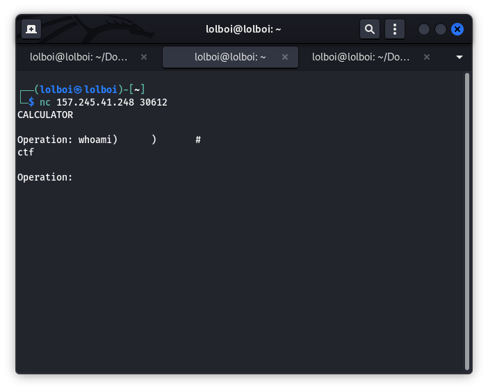
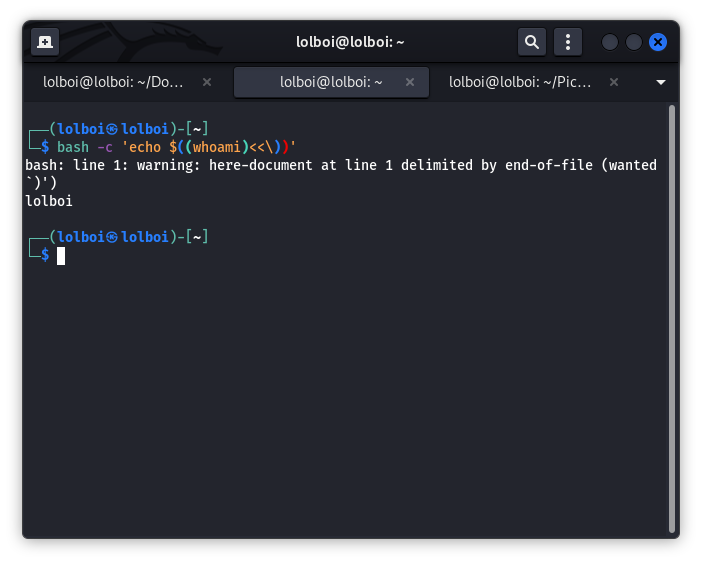
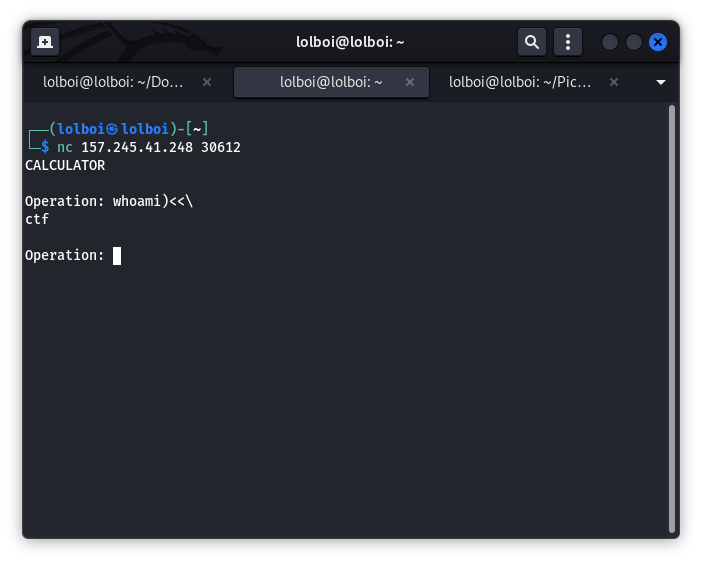

Bashic Calculator
=================

Bashic Calculator made me target my own lack of understanding how certain payloads can be constructed and the full depth of the ocean that is the bash script. Hold on to this one, because I'm not sure about this completely. (Any help in deciphering the commands would be lovely.) Big Props to xtal from HTB forums, dotPY and avijneyam from the HTB discord.

We start off with HTB giving us a .zip containing the main.go file that we need to analyze to break the calculator. We can connect to the calculator with the following command: `nc IP_ADDR PORT`.

In the main.go file, we are introduced to this line:

```
firewall := []string{" ", "`", "$", "&", "|", ";", ">"}

...

op = strings.ReplaceAll(op, v, "")
```

What this tells me is that the firewall restricts most special characters except tab space, <, \, /, { } and we have to work around that. It also provides how the command is executed:

```
wrapperCmd := exec.CommandContext(ctx, "bash", "-c", cmd)

...

command := "echo $((" + op + "))" 
```

So by the end of it, the command is to look something like this:

```
bash -c 'echo $((WHAT_YOU_TYPE))'
```

Great, now that we know that, lets think about how we can break this. There are 2 ways that I know of, but I don't know the true logic behind. I will show both the methods and give an explaination which I think makes sense but if there are corrections, please go ahead and lemme know.


### Method 1: (Easy way)

`echo $(( expression ))` is used to print an arithmetic expression. But, for some reason, if you make the command like this `echo $(( expression) )`, it will run the expression as a command. My guess is that the `$()` is used to subsitute a command and because of that, it looks for the first semblance of a command and tries to run that due to the the last ` )` has a space in between and doesn't register as an arithmetic expression. Regardless, you will ask why this is important because spaces are illegal. Tab spaces aren't, so you will make your payload look something like this:

```
command)	)	#
```

A quick example will look like this:



You can find the flag in the `/` directory. To read the flag, make a command that looks like this:

```
cat	/flag.txt)	)	#
```


### Method 2: (Slightly more complicated)

We can go off the previous knowledge but instead of tab spaces, we will use the other legal special characters, namely the <, { } and the \ character.

< is used for output redirection, > is used for output redirection, no problem. But there are more things you can do like <<, >>, <<<, >>> which I am not gonna explain except <<.

<< can work as a bitwise operator OR as a `here-document` structure. You give the program a demlimiter to work along with some input and whenever the delimiter is seen, bash will read the input and perform a task.
So your payload will look like this:

```
whoami)<<\
```

Here we can see like before, instead of directly ending with ) we add some more text, so the command will not work on it as it normally should. Plus, we see that we don't have a delimiter assigned so it will automatically take that to be EOF. And lastly, the \ is used to ignore 1 special character, namely one of the ) in the bash scripts that will prove problematic to us. So the full command will look like this:

```
bash -c 'echo $((whoami)<<\))'
```

The full output will look like this:



But on the CTF, it looks like this:



Before you go off on your adventures, you must know that none of the commands will function except this one (atleast thats what I think), unless you do 1 final modification. In bash, you can use the {} to write commands and arguments without space, so an `ls -la` command can be written as `{ls,-la}` on bash (You have to get a bash shell first, won't work on your terminal normally)

So, your final payload to get the flag will look like this:

```
{cat,/flag.txt})<<\
```
