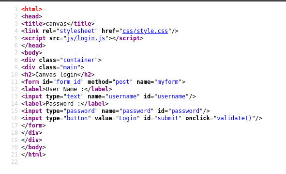
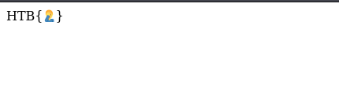

Canvas is a really nice "feel good" CTF that really brought me back to when I was studying programming, not that I would do it anymore, but it still felt nice.

Once you download the given files, you are provided with a pair of `.html`, a `.css` and a `.js` file. They are a pretty straightforward login page and dashboard config. If you open the source code of index.html, you see this:



This shows that the html sends your credentials to a function called `validate()` in `js/login.js`. Fair enough.

If you put the username and password as admin, you are directed to the dashboard.html which has this to offer:



Looking at the source code in `login.js`, you see a lot of \x and 0x and random numbers associated with them. This is called code obsfuscation and is used to secure the source code through base64 overcoding, using ascii codes and even using weird variable names. Its main goal is to make it difficult to understand what the code is doing. You can unobfuscate the code on this website: https://www.dcode.fr/javascript-unobfuscator

When you are done with that, you can use a code beautifier to make it even more easier to read and look under the hood.

When you are reading the code, you notice this particular line:
```
var res = String["fromCharCode"](72, 84, 66, 123, 87, 51, 76, 99, 48, 109, 51, 95, 55, 48, 95, 74, 52, 86, 52, 53, 67, 82, 49, 112, 55, 95, 100, 51, 48, 98, 70, 117, 53, 67, 52, 55, 49, 48, 78, 125, 10);
```

This converts ASCII codes to characters, but this variable isn't used anywhere, so you can make a quick decoder with python or use any other method to decode this. Below is what I used:

```
a = [72, 84, 66, 123, 87, 51, 76, 99, 48, 109, 51, 95, 55, 48, 95, 74, 52, 86, 52, 53, 67, 82, 49, 112, 55, 95, 100, 51, 48, 98, 70, 117, 53, 67, 52, 55, 49, 48, 78, 125, 10]

b = ""

for aa in a:
    b += chr(aa)
print(b)
```

The flag will be available on the output.
