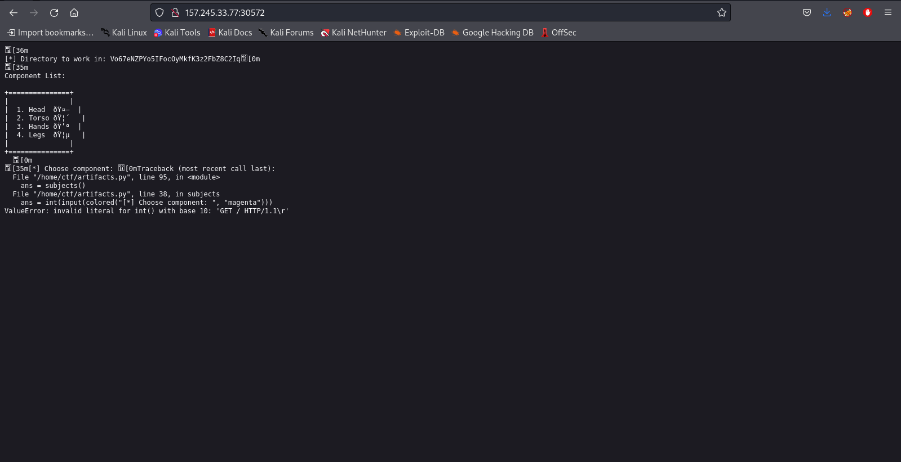
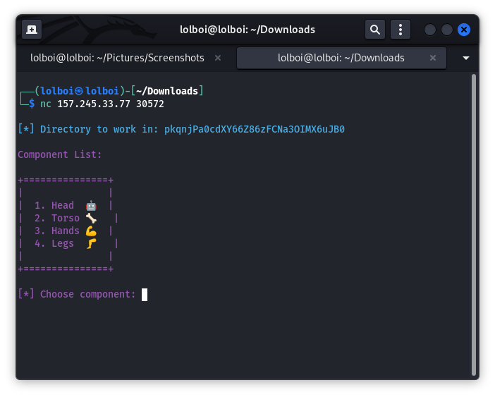
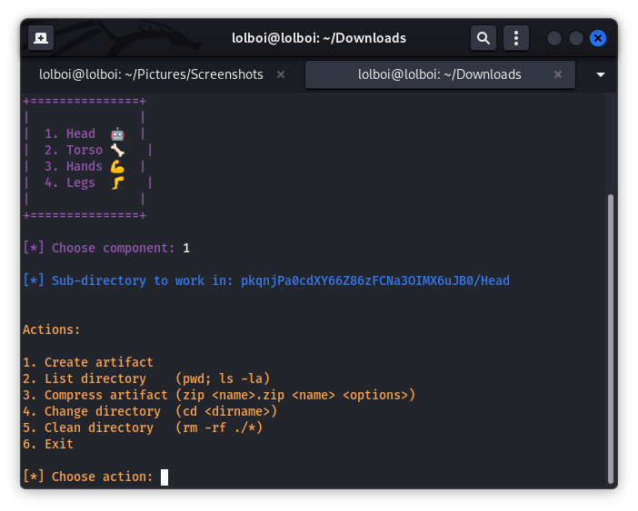
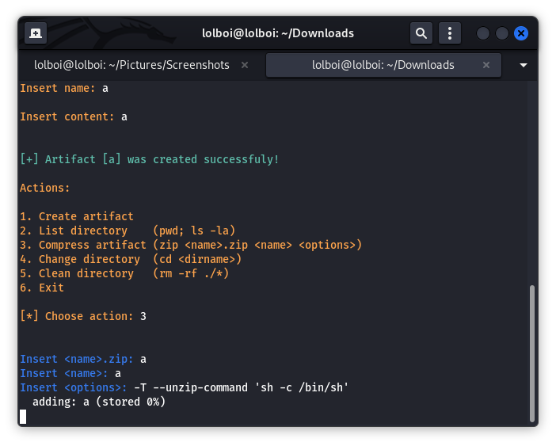

Compressor
==========

HackTheBox had an easier version of this CTF earlier but then decided to make this WAY more complicated than it should be, but hey, nothing too bad, we can live with this :')

CTF starts with providing us a link that looks something like this: `http://157.245.33.77:30572/`

On our browser it will look like this:

We can use netcat on this link with a command that looks like this: `nc 157.245.33.77 30572` to connect to the instance

We get an interface that looks like this:

We can head into a component by selecting the number associated with it. Doing this will lead us to more options provided, which look like commands that can be run in the working directory:

In the previous version of this CTF, there was a `cat` option provided which helped us look into the `/home/ctf/artifacts.py` directory and see the source code, but now we have to figure this bit out by ourself and try to see what we can exploit.

We can't exploit `cd`, `rm`, `pwd; ls -la` so our best shot is looking if something is possible with the `zip` command. Looking into the man pages (https://linux.die.net/man/1/zip) we see that we can run it using the `-TT` and the `-T --unzip-command` options, I tried both of them and the latter worked for me, so lets see how that works.

We first make an artifact with the first option (name and content doesn't matter), and then we use the zip command (I named my artifact `a`) and input a `.zip` name and the name of the file we want to archive (the artifact you just made) and run the following in options: `-T --unzip-command 'sh -c /bin/sh'` (You can also use `-T --unzip-command 'sh #'`)

This is done because bash didn't work for some reason. It should look like this (the shell looks like a new line, just type your commands to it):

We are provided a shell and can look at the home directory to see if there is anything, in the `/home/ctf` we will find flag.txt that we can view to find the flag
