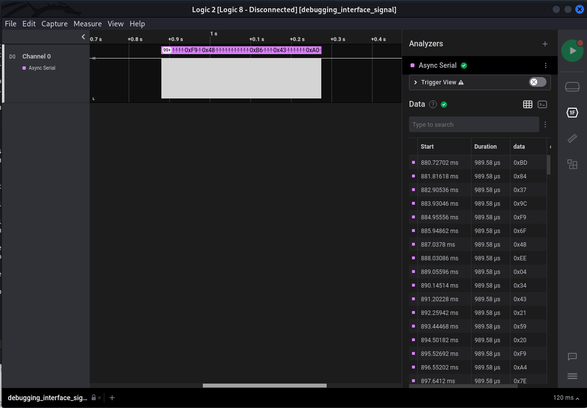

Debugging Interface
===================

When I heard that this one was about hardware, I knew this would contain complicated sounding terms and a lot of binary or hex codes. Fortunately, this task takes mercy on me and provides all answers with simple OSINT.

We are introduced to the task description:

We are also provided with task files, which is a .zip containing a .sal file. Now I have never heard of this file extension, so I decide to look into it, and most of the results are very misleading. Instead, your first approach should be looking up the task topic provided and find out what asynchronous serial communication is.

Here is what you need to know about it:
- Asynchronous means no-clock (essentially not time-based)
- Serial means one bit at a time 
- Communication means transfer of data/information from one end to the other

So, Asynchronous Serial Communication means communication that occurs one bit at a time and isn't synchronized by a clock signal.

Now that we know what async serial communication is, all we need to do is lookup how to decode it, so we make a simple google query which goes:

The first link takes us to the support page for an application called Saleae Logic 2 which is supposed to be an analyzer for serial communication. This seems interesting, so lets download it.

Once you download it, give it execute permission with `chmod -x` or `chmod 700` and run the app with `./`.

The app starts up and gives you an option to open a capture. We open the .sal file provided to us and it gives us an interface that looks like this.

From this point out, the offical documentation of the saleae help us figure out working with with.

Link here: https://support.saleae.com/protocol-analyzers/analyzer-user-guides/using-async-serial

First we run the analyzer on the capture, this is done by clicking on these buttons:

Once we do that,we are presented with this:

After saving the config, we get a page that looks something like this:

Upon zoom in, we get to know that there are frame errors, this just means that the application is not able to process the frames of information due to some config issues (bits being read too fast or too slow), we look to the support page for this and find that this could be because of the bitrate.

The support page provides us a way to find out how to determine the proper bitrate:

> Hover your mouse over the fastest 2-bits, and then take the inverse. One way to do this is to find a 2 bits of data that are opposite in state so you can measure the distance between the two transitions and take the inverse of that measurement to get its bit rate. The software will show auto-measurements for the following.

The first frame itself is an example for the fastest bit and we can see that the inverse is 31230, so I put that as the bitrate and we see that we no longer have any frame errors. 

Change the tab from data table to terminal from here:

And look through that for the flag.
