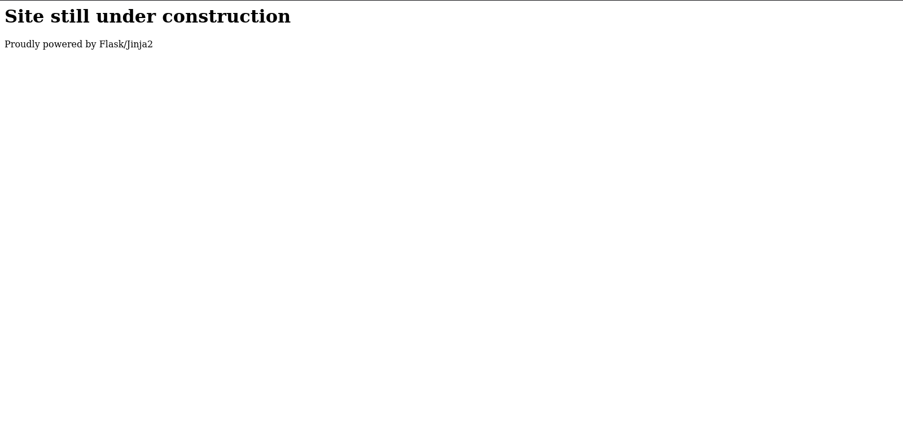
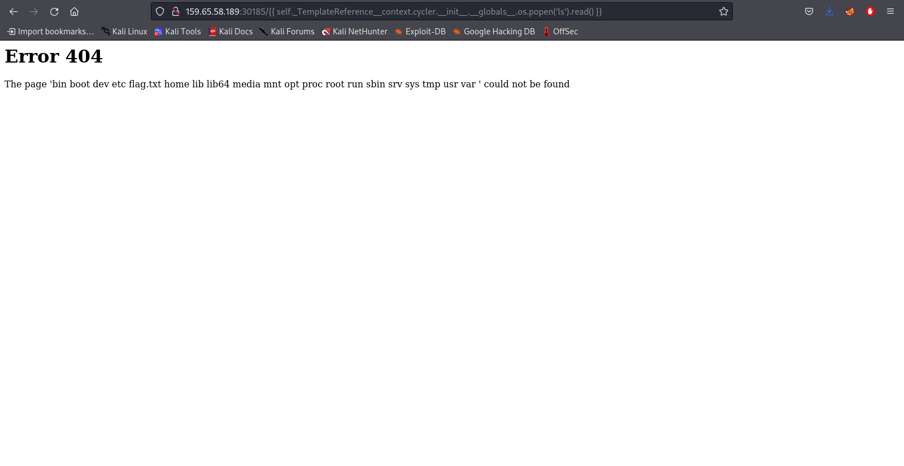

Templated
=========

This one adds a bit of googling to the mix, but still quite a fun CTF.

We are presented with an IP address and a port number where the https server is hosted and we are presented with this screen:

We see that the site running Flast/Jinja2, and since I know nothing about it I do a little digging.
Flask is a python web app framework and Jinja is a template engine also written in python. These both are used together to make web apps.

The first step I take is look for any existing exploits and almost immediately run across a Server-Side Template Injection(SSTI) exploit. Easy enough, time to look for an exploit that suits us. In the payloads of all things repository (specifically here: https://github.com/swisskyrepo/PayloadsAllTheThings/tree/master/Server%20Side%20Template%20Injection#jinja2---remote-code-execution) we see a Remote Code Execution payload, lets try to see what directory we end up in:

We see a flag.txt there, use `cat flag.txt` and we get the flag
