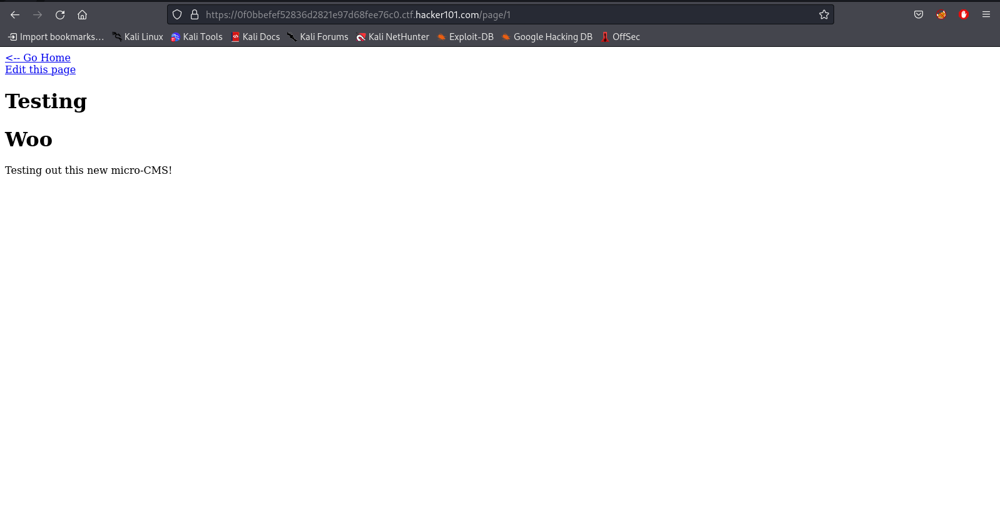

I vaguely remember doing these when I was starting out and getting confused of what hackerone expected from me, but hey, the first step is research and thats what I reckon you need to tackle anything in infosec or IRL. Getting back to the CTF though;

We get started with this page that has links taking us to other pages, so lets see where that leads us:

In the Testing page, this shows up:

In the url, we see a `page/VALUE` which indicates that each page in this web app has a page number and we can there might be something to see here. Start from 0 and change the value to check if we can view something we aren't supposed to see.

We see here that `page/7` is Forbidden, lets keep this in mind and look at it later:

The Create page helps you create more web pages using HTML with Markdown support and tells us that scripts are not supported, lets confirm that.
 
So I decided to add this bit of XSS payload to every available input `<IFRAME SRC="javascript:javascript:alert(1);"></IFRAME>` and added a button to try mask it too (Only doing it to the title works, but I didn't want to take chances), lets try saving this:

We see something like this:
 

 
And if we go to the main page then we get the first flag.
 
If we see the Markdown Test page again, we see that we are able to edit that page, lets see if we can do something there:
 

 
We have another editable value available in the URL at `/page/edit/VALUE`, lets try to put the value 7 since it was shown as forbidden earlier. This will show you the second flag
 
In the edit page itself, we can test for SQL injection in the `/page/edit/VALUE` parameter by using `'` like this:

Doing this will show you the third flag.

Lastly, since my poor knowledge of how HTML works, I wasn't able to correctly bypass and run a script. Research on https://w3schools.com showed that HTML events exist and that `<button>` uses an `onlick` event to run javascript. So we make a payload that looks like this `<button onclick="alert('1')">Click me</button>`, and run it, then check the page source, you'll find the final flag (Thank you for making it so obvious HackerOne >:( )
