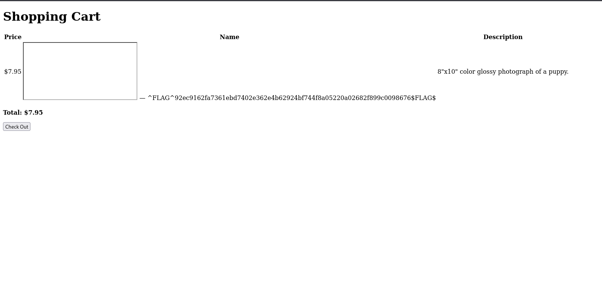

Petshop Pro
===========

I used to have nightmares about this one because I was working on Windows at the time and BurpSuite at community version was just NOT fast enough.

Starting off this CTF, we are greeted to this screen:

You can click on the kitten and puppy links to add a unit of them to the cart, and check out. When dealing with this, the first thing I look for is how the packet looks and if I can mess with it.

As you can see on BurpSuite, we get the whole entry for checkout and can try sending malformed packets in order to trick the web app.

e create an entry that looks something like this and URL encode it: `[[0, {"logo": "kitten.jpg", "price": -8.95, "name": "Kitten", "desc": "8\"x10\" color glossy photograph of a kitten."}]]`

As you can see on BurpSuite, you get the first flag.

Now, we look for a login, and easily find it as `/login`. Keep in mind, we cannot use SQL injection here (I tried a lot. Even if you can, its easier to brute force.)

For this one, I have tried using tools like wfuzz and hydra and other brute forcing tools, but none work as well as BurpSuite's Turbo Intruder extension. Documentation and instructions for download can be found here: https://portswigger.net/bappstore/9abaa233088242e8be252cd4ff534988

To login here, you will need a good wordlist, you can try something like rockyou.txt or look for the many wordlists out there, but all you need is patience and decently large wordlist to login. (my credentials were, username: dulcine password: uucp but it'll probably be different for you) You should find the second flag right after you login.

After you log in, you are given the ability to edit the products available, this beings forth a hint that XSS could be possible. We can try this by inputing this in the name section: `<IFRAME SRC="javascript:alert('XSS');"></IFRAME>` It should look something like this:

We save this and then we try to check out with this item. On the check out page, we see the last flag. It looks something like this:

