# Postbook

PostBook is a CTF that focusses on vulnerabiities such as Cookie Decoding (Session Management) and Web Parameter Tampering. Since HackerOne doesn't focus its CTF's on gaining root, it is a little arbitrary but provide invaluable insight onto vulnerabilities.

## Enumeration:

This is the home page of the web application:

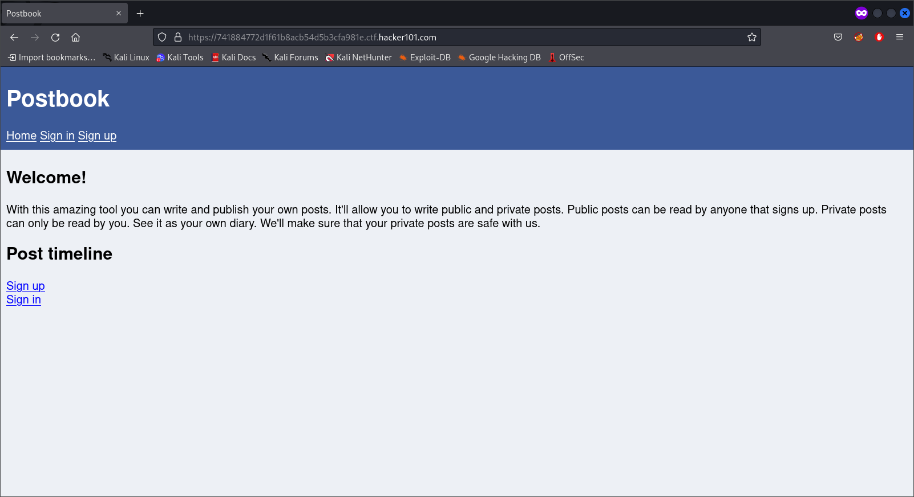

From here on, you can sign up and make an account or sign in. Since we don't have any creds, we can try making a new account first and seeing what we can do. Make an account called `test` (you don't need password but it doesn't matter). Also, the SignUp page has the following code:

```html
<script>
      function validate() {
        var username = document.getElementById('username');
        var submit = document.getElementById('submit');

        if(/^[a-z]+$/.test(username.value)) {
          submit.disabled = false;
        } else {
          submit.disabled = true;
        }
      }
    </script>
```

This is a regex entry to validate only text as the username. No numbers or symbols are allowed in the username.

Once you make the `test` account, you can sign in with it and you will be greeted by this page:

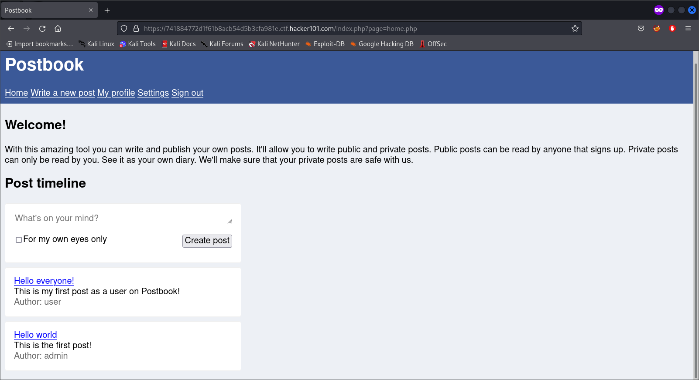

Here, you can write posts, edit posts, delete posts, check your profile, change your account settings and sign out. From here on, we can start with the exploits.

## Exploits

### Flag 1:

Click on the `Hello World` admin post, and look at the URL:

```url
https://74[REDACTED].ctf.hacker101.com/index.php?page=view.php&id=1
```

The post has an ID parameter set to 1. Change the parameter value to 2 and you will see the first flag and the hidden admin post.

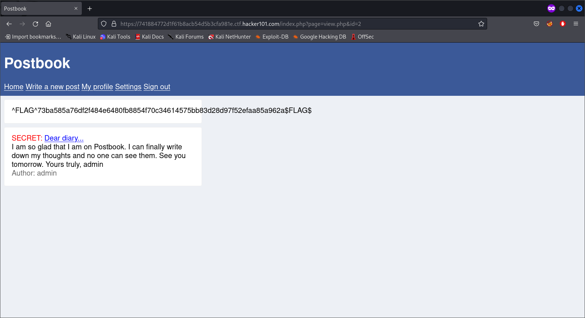

### Flag 2:

Go to the `My Profile` page, and we can see the following:

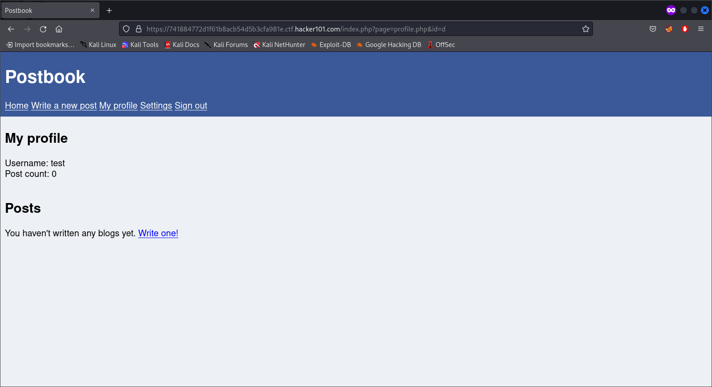

Like the post URL, the profile page also has an ID parameter:

```url
https://74[REDACTED].ctf.hacker101.com/index.php?page=profile.php&id=d
```

Here, the ID parameter is set as `d` for our test user, which means that there could be ID's ranging from a-c. ID `a` doesn't have an account, ID `b` is the admin account (Where you can see their secret post), ID `c` is an account named`user`. Unfortunately, we are not able to edit their posts or delete them. We can try bruteforcing into the accounts (I tried SQL injection, it didn't work). The user account's password is `password`. There you will find the flag in their home page.

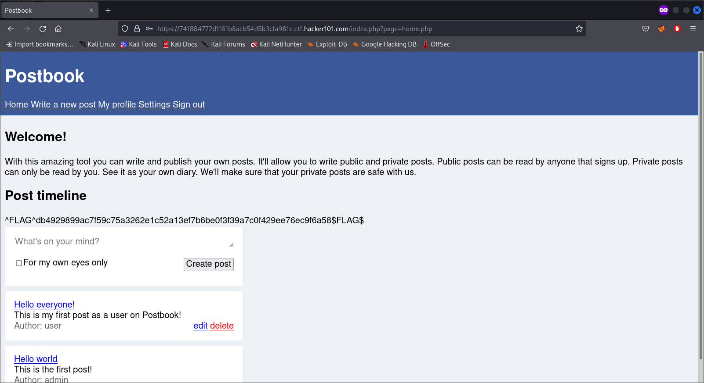

### Flag 3:

Since we have done enough parameter manipulation, we try to see if we can execute javascript or not. Despite all my obfuscation, I didn't manage to execute code. However, while looking at the page source of the `Write a new post` page, we see a very interesting line:

```html
<input type="hidden" name="user_id" value="2" />
```

Go to the Inspect element page and edit the value to 1 and make your post. Once you post it, you will be given the flag.

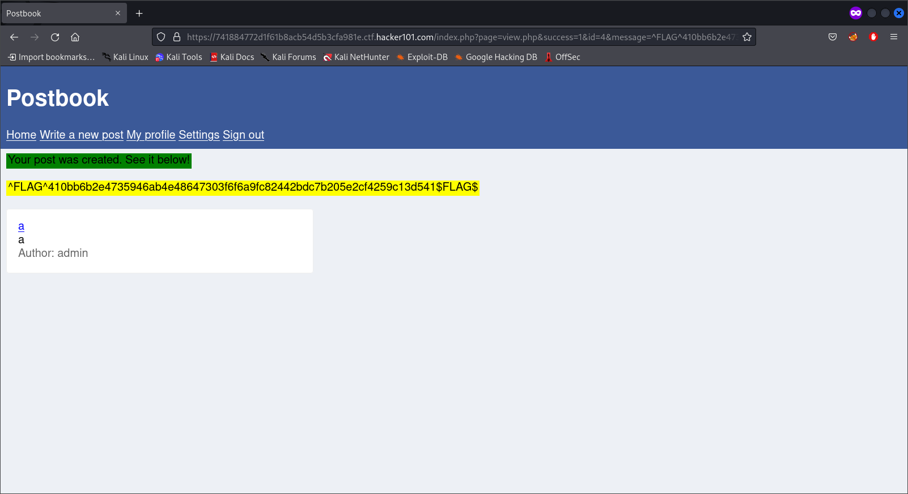

### Flag 4:

Although it took a while to figure out. There is a hidden post which can be seen with the ID of `945`.

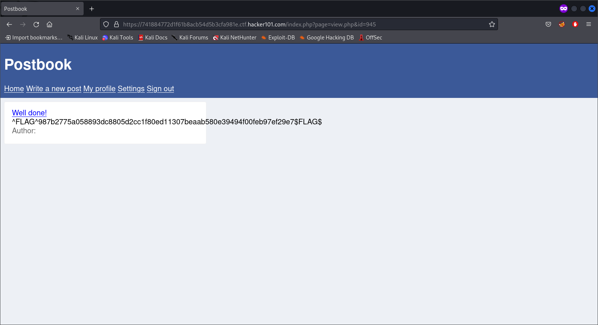

### Flag 5:

Here, we will try to see if we can edit someone else's post. To do this, we look at the edit post page for any one of our posts.

```url
https://74[REDACTED].ctf.hacker101.com/index.php?page=edit.php&id=3
```

Here, there is another ID parameter, which can be manipulated. Change the value to 2 and add anything to the post and save the changes.

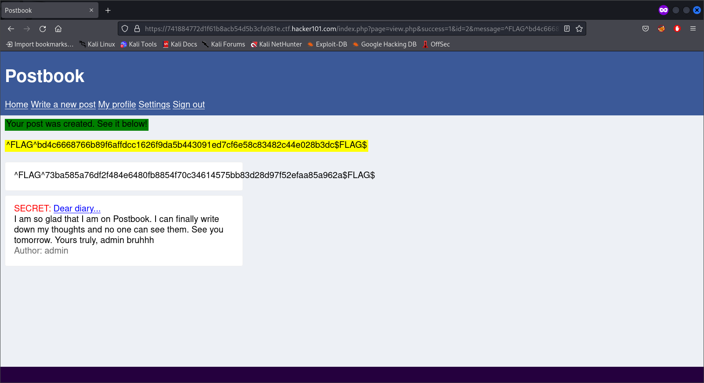

### Flag 6:

For this flag, we have to decode and hijack the cookie values. Look at the cookies in your brower's Developer Tools option.

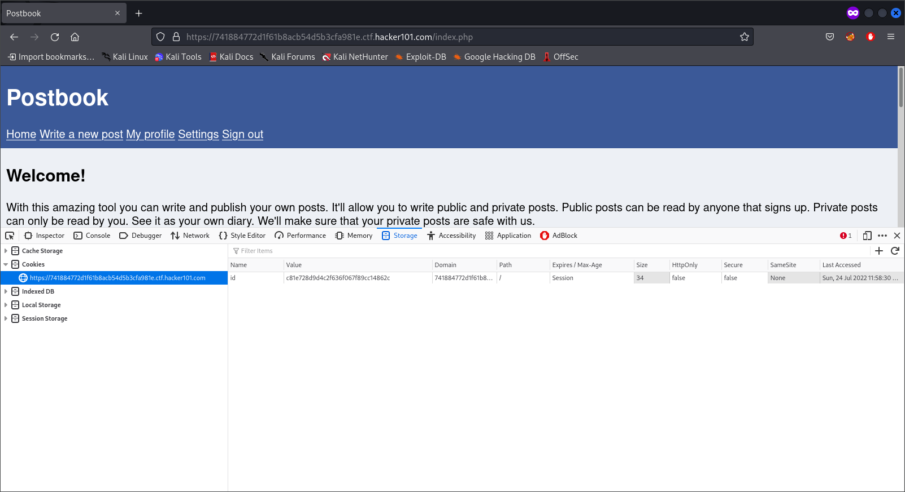

The `id` cookie is what the webapp uses to keep us signed in. The cookie value is a MD5 hash of your user id.

Tip: You can use this website (https://md5.gromweb.com/) to convert values to and from MD5.

Change the value to `c4ca4238a0b923820dcc509a6f75849b` and reload the page. You will find the flag in the home page.

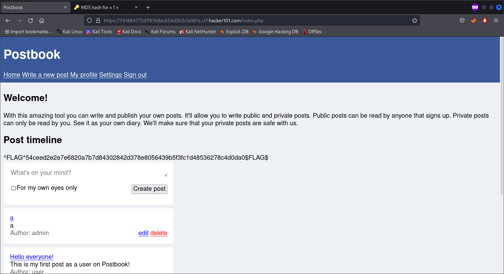

### Flag 7:

On this last flag, we will try to delete a post from another user. Start up burpsuite and start intercepting packets. On clicking delete, the packet information looks like this:

```http
GET /index.php?page=delete.php&id=c4ca4238a0b923820dcc509a6f75849b HTTP/1.1
...
```

Here, the id is an MD5 hash of the post ID. Change the id to the MD5 hash of a post not written by you and send the packet. With this, you get the last flag:

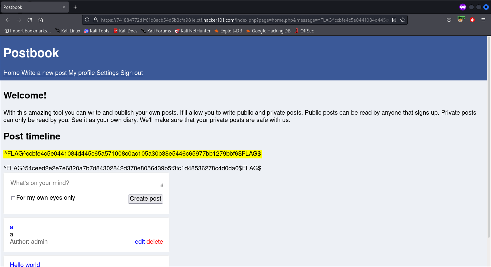
